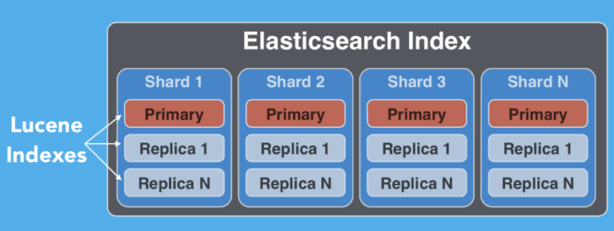
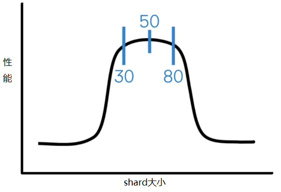

# 基本概念

ES 和 关系型数据库的概念比较
|RelationDB|Elasticsearch|Description|
|--|--|--|
|row|document|document(文档), 相当于数据库中的一行数据, 文档格式为`json`|
|db|index| index(索引), 多 type(类型)的 document(文档)的集合, 类似数据库中的数据库, es9 中, 会弃用 type, 到时的 index 则类似数据库中的表|
|table|type| 一个 index(索引) 中, 可存放多 type(类型)的 document(文档), 类似数据库中的表, es9 中, 会弃用 type|
|column|field|field(字段), json 中的某个字段, 相当于数据库中的某一列|
|schema| mapping| mapping(映射), index(索引)中的约束, 类似数据库中的表结构(schema)|
|sql| dsl| es 的 json 风格的查询语句, 有点类似 mongo 的查询语句|

> Relational DB ‐> Databases ‐> Tables ‐> Rows ‐> Columns<br>
> Elasticsearch ‐> Indices ‐> Types ‐> Documents ‐> Fields

1. document 文档

   单条记录成为 document(文档), 相当于关系型数据库中的**一行数据**

2. index 索引

   多个文档的集合, 成为 index(索引), 其中支持多种 type(类型)的 document(文档), 故 index(索引)相当于关系型数据库中的**数据库**

3. type 类型 (**es9 弃用**)

   一个索引中, 可以存放的文档的 type(类型)可以为多个, 故 type(类型)相当于关系型数据库中的**表**

4. field 字段

   相当于是数据表的字段，对文档数据根据不同属性进行的分类标识

5. mapping 映射

   处理数据的方式和规则方面做一些限制. <br>
   如某个字段的数据类型、默认值、分析器、是否被索引等, 这些都是映射里面可以设置的<br>
   其它就是处理 es 里面数据的一些使用规则设置也叫做映射<br>
   按着最优规则处理数据对性能提高很大，因此才需要建立映射，并且需要思考如何建立映射才能对性能更好

6. cluster 集群
   一个集群就是由一个或多个节点组织在一起，它们共同持有整个的数据，并一起提供索引和搜索功能，默认为“elasticsearch”<br>
   集群名称很重要，相同集群名的节点才会组成一个集群。集群名称可以在配置文件中指定

7. node 节点
   一个节点是集群中的一个服务器，作为集群的一部分，它存储数据，参与集群的索引和搜索功能

8. shard 分片
   创建索引时, 可以指定分成多个分片来存储。每个分片是一个功能完善且独立的“索引”，可以被放置在集群的任意节点上。分片的好处：允许水平切分/扩展容量，可在多个分片上进行分布式的、并行的操作，提高系统的性能和吞吐量

9. replica 副本
   副本是分片的精准复制, 每个分片可有零个或多个副本. 副本的好处: 提高查询吞吐量和实现高可用.

# 节点类型

(1) master-eligible node

负责轻量级的集群管理工作, master-eligible node 都有机会被选举为一个 master node<br>
作为 master node, 需要负责管理集群, 尽量不要作为 data node 使用, data node 需要负责复杂数据存储, 同时作为 master node 和 data node, 可能会不稳定
master node 必须有权限访问 path.data 指定的 data 目录，因为 master node 需要在 data 目录中存储 cluster state

```yml
node.master: true
node.data: false
node.ingest: false
```

(2) data node 数据节点

data node 负责存储 shard 的数据，也就是那些 document, document 的操作比较占用资源, 故需视情况调整 node 的数量

```yml
node.master: false
node.data: true
node.ingest: false
```

(3) ingest node 摄取节点

可以执行预处理 pipeline，包含了多个 ingest processors。不同的 ingest processor 执行的操作类型是不同的，那么对资源的需求也是不同的，不过还是最好是规划一批单独的 ingest node 出来，不要跟 master node 和 data node 混合在一起。

```yml
node.master: false
node.data: false
node.ingest: true
```

(4) cooridnating only node 协调节点

如果一个节点不担任 master 节点的职责，不保存数据，也不预处理文档，那么这个节点将拥有一个仅可路由请求，处理搜索缩减阶段并分配批量索引的协调节点。 本质上，仅协调节点可充当智能负载平衡器。默认 elasticsearch 的所有节点都可以作为协调节点去路由和分发请求。

```yml
node.master: false
node.voting_only: false
node.data: false
node.ingest: false
node.ml: false
cluster.remote.connect: false
```

(5) machine learning node 机器学习节点

机器学习节点提供了机器学习功能，该节点运行 job 并处理机器学习 API 请求。 如果 `xpack.ml.enabled` 设置为`true`，并且`node.ml`设置为`false`，则该节点可以处理 API 请求，但不能运行 job。

   <hr>

node(节点)类型相关及配置, 可见 [官方文档](https://www.elastic.co/guide/en/elasticsearch/reference/7.5/modules-node.html)

# Master，Elections，Quorum 及 脑裂

https://elasticstack.blog.csdn.net/article/details/129396057

# 分片

每个索引由一个或多个分片组成。每个分片都是 Lucene 索引的一个实例，你可以将其视为一个独立的搜索引擎，它为 Elasticsearch 集群中的数据子集编制索引并处理查询。

当数据写入分片时，它会定期发布到磁盘上新的**不可变 Lucene 段**中，此时它可以用于查询。这称为`刷新`。

随着分段数量的增加，这些分段会定期合并为更大的分段。这个过程称为`合并`。由于所有段都是不可变的，这意味着使用的磁盘空间通常会在索引期间波动，因为需要先创建新的合并段，然后才能删除它们替换的段。**合并可能会占用大量资源，尤其是在磁盘 I/O 方面**。

分片的大小没有限制, 通常 50GB 较好, shard 大小和性能的变化关系图如下:


在单个分片中的查询, 是单个线程执行的,

# 性能

[Elasticsearch：提升 Elasticsearch 性能](https://elasticstack.blog.csdn.net/article/details/129118032)
[Elasticsearch：如何提高查询性能](https://elasticstack.blog.csdn.net/article/details/122713496)
[Elasticsearch：增加 Elasticsearch 写入吞吐量和速度的完整指南](https://elasticstack.blog.csdn.net/article/details/115158829)

# 文档操作

## 判断文档存在

```
HEAD /{index}/_doc/{id}
// 存在则200, 不存在则404
// 200 - OK
// 404 - Not Found
```

## 文档创建

```
POST /{index}/_doc
POST /{index}/_doc/{id}
POST /{index}/_create/{id}

{
   "{field}": "{value}"
}
```

> 上述三种 url pattern 都可

## 文档更新

**文档在 es 中是不变的**, 因此, 更新一个现存文档(包括更新整个文档和部分更新某个文档), 需要将其标记为已删除, 并添加新版本, 即下列四个步骤:

1. Retrieve the JSON from the old document
2. Change it
3. Delete the old document
4. Index a new document

### 更新整个文档

```
PUT /{index}/_doc/{id}
{
   "{field}": "{value}"
}
```

> 请求提交后, 会更新整个文档

> [Updating a Whole Document](https://www.elastic.co/guide/en/elasticsearch/guide/2.x/update-doc.html)

### 部分更新某个文档

部分更新某个文档时, 存在的 field 会被覆盖, 不存在的 field 会被追加 <br>(Objects are merged together, existing scalar fields are overwritten, and new fields are added)

1. 普通更新

   ```
   POST /{index}/_update/{id}
   {
   "doc": {
      "{field}": "{value}"
   }
   }
   ```

2. 使用脚本更新

   ```
   POST /{index}/_update/{id}
   {
      "script" : "ctx._source.num+=1"
   }
   ```

   > 上述例子为修改 json 中的 num, 使其加一

   默认的脚本语言是`Groovy`, 需开启 groovy 沙盒功能, 即

   ```yml
   # config/elasticsearch.yml
   script.groovy.sandbox.enabled: true
   ```

3. 更新一个可能不存在的文档
   假设现在有个需求, 是统计页面访问数量, 但是页面内容 es 中不一定存在, 更新则会失败, 此时可以用 upsert, 如果待更新的文档不存在, 则会新建.

   ```
   POST /{index}/_update/{id}
   {
      "script" : "ctx._source.views+=1",
      "upsert": {
         "views": 1
      }
   }
   ```

<hr>

[Partial Updates to Documents](https://www.elastic.co/guide/en/elasticsearch/guide/2.x/partial-updates.html)

## 文档删除

```
DELETE /{index}/_doc/{id}
```

删除文档是找到该文档, 然后将其标记为已删除. 被删除的文档会继续占用磁盘空间和部分系统资源, 直到合并出来.

> [Deleting a Document](https://www.elastic.co/guide/en/elasticsearch/guide/2.x/delete-doc.html)

> [Lucene's Handling of Deleted Documents](https://www.elastic.co/cn/blog/lucenes-handling-of-deleted-documents)

# 查看集群信息常用指令

1. `GET /` 查看某节点信息
   ```json
   // GET /
   {
     // 节点名称
     "name": "es_node",
     // 集群名称
     "cluster_name": "docker-cluster",
     "cluster_uuid": "Bvq639RWRiGjW5j8ohI4pg",
     "version": {
       // es版本
       "number": "7.5.0",
       "build_flavor": "default",
       "build_type": "docker",
       "build_hash": "e9ccaed468e2fac2275a3761849cbee64b39519f",
       "build_date": "2019-11-26T01:06:52.518245Z",
       "build_snapshot": false,
       // lucene版本
       "lucene_version": "8.3.0",
       "minimum_wire_compatibility_version": "6.8.0",
       "minimum_index_compatibility_version": "6.0.0-beta1"
     },
     "tagline": "You Know, for Search"
   }
   ```

常用于查看 es 服务是否启动成功

2. `GET /_cat/nodes` 查看集群节点信息

   `GET /_cat/nodes?v`

   ```
   ip          heap.percent ram.percent cpu load_1m load_5m load_15m node.role master name
   177.178.3.3           44          99   5    0.41    0.34     0.43 dilm      *      es02
   177.178.3.2           55          99   5    0.41    0.34     0.43 dilm      -      es01
   ```

   | 字段         | 说明                                       |
   | ------------ | ------------------------------------------ |
   | ip           | 节点 ip                                    |
   | heap.percent | 堆内存使用百分比                           |
   | ram.percent  | 运行内存使用百分比                         |
   | cpu          | cpu 使用百分比                             |
   | load_1m      | 过去 1 分钟的网关平均负载                  |
   | load_5m      | 过去 5 分钟的网关平均负载                  |
   | load_15m     | 过去 15 分钟的网关平均负载                 |
   | node.role    |                                            |
   | master       | 是否 master 节点, 带\* 表明是，带-表明不是 |
   | name         | 节点名称                                   |

3. `GET /_cat/shards`查看分片信息

   `GET /_cat/shards?v`

   ```
   index                    shard prirep state   docs   store ip          node
   .kibana_1                0     r      STARTED   10  14.9kb 177.178.3.3 es02
   .kibana_1                0     p      STARTED   10  38.6kb 177.178.3.2 es01
   .kibana_task_manager_1   0     p      STARTED    2  31.6kb 177.178.3.3 es02
   .kibana_task_manager_1   0     r      STARTED    2  31.6kb 177.178.3.2 es01
   .apm-agent-configuration 0     p      STARTED    0    283b 177.178.3.3 es02
   .apm-agent-configuration 0     r      STARTED    0    283b 177.178.3.2 es01
   test                     0     p      STARTED   11 218.7mb 177.178.3.3 es02
   test                     0     r      STARTED   11 153.5mb 177.178.3.2 es01
   ```

   | 字段   | 说明                               |
   | ------ | ---------------------------------- |
   | index  | 索引名称                           |
   | shard  | 分片数                             |
   | prirep | 分片类型，p 为主分片，r 为复制分片 |
   | state  | 分片状态，STARTED 为正常           |
   | docs   | 文档数                             |
   | store  | 存储大小                           |
   | ip     | 节点 ip                            |
   | node   | 节点名称                           |

4. `GET /_cat/indices`查看分片信息

   `GET /_cat/indices?v`

   ```
   health status index                    uuid                   pri rep docs.count docs.deleted store.size pri.store.size
   green  open   test                     LsKJ7q6SSMm8jFQK8Jzmtw   1   1         11          345    377.6mb        222.9mb
   green  open   .kibana_task_manager_1   EHTaS0p7RVa016LaYyBLLA   1   1          2            0     63.2kb         31.6kb
   green  open   .apm-agent-configuration H7QK1nOxQ1u0BUYroWWeug   1   1          0            0       566b           283b
   green  open   .kibana_1                N959M6KCRsuNSIpazQdALw   1   1         10            3     53.6kb         38.6kb
   ```

   | 字段           | 说明               |
   | -------------- | ------------------ |
   | index          | 索引名称           |
   | uuid           | uuid               |
   | docs.count     | 文档总数           |
   | docs.deleted   | 已删除文档数       |
   | store.size     | 存储的总容量       |
   | pri.store.size | 主分片的存储总容量 |
