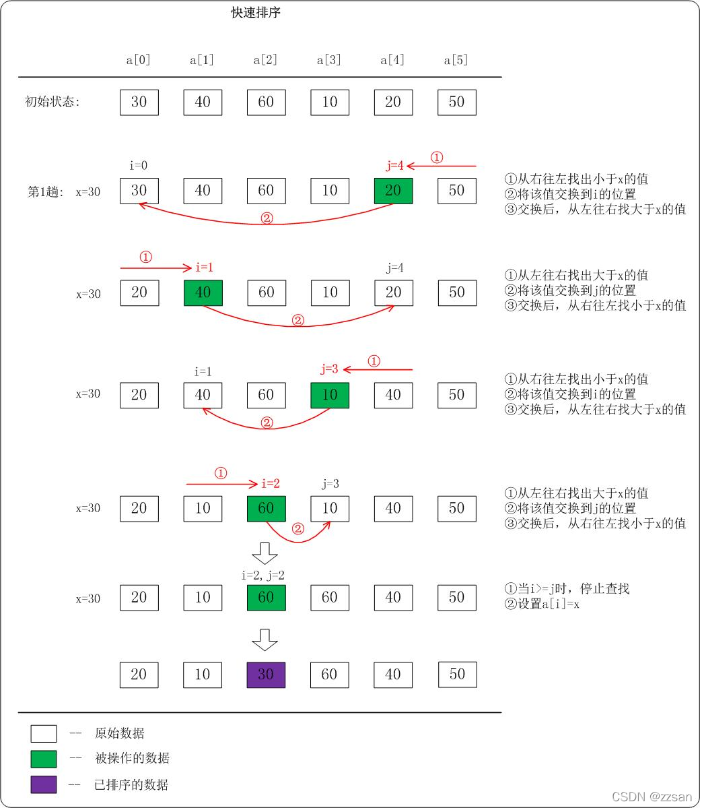

## 概述

### 总览

| 排序算法 | 时间复杂度 (平均) | 时间复杂度 (最好) | 时间复杂度 (最坏) | 空间复杂度 | 稳定性 | 排序方式  |
| -------- | ----------------- | ----------------- | ----------------- | ---------- | ------ | --------- |
| 冒泡排序 | O( n^2^ )         | O( n )            | O( n^2^ )         | O( 1 )     | 稳定   | In-place  |
| 选择排序 | O( n^2^ )         | O( n^2^ )         | O( n^2^ )         | O( 1 )     | 不稳定 | In-place  |
| 插入排序 | O( n^2^ )         | O( n )            | O( n^2^ )         | O( 1 )     | 稳定   | In-place  |
| 希尔排序 | O( n^1.3^ )       | O( n )            | O( n^2^ )         | O( 1 )     | 不稳定 | In-place  |
| 归并排序 | O( n logn )       | O( n logn )       | O( n logn )       | O( n )     | 稳定   | Out-place |
| 快速排序 | O( n logn )       | O( n logn )       | O( n^2^ )         | O( logn )  | 不稳定 | In-place  |
| 堆排序   | O( n logn )       | O( n logn )       | O( n logn )       | O( log1 )  | 不稳定 | In-place  |

> **稳定** : 排序前后, 两个相等键值的顺序不变
> **n** : 数据规模
> **k** : 桶的个数
> **In-place** : 不占用额外内存，只占用常数内存
> **Out-place** : 占用额外内存

## 冒泡排序 Bubble Sort

1. 比较相邻的元素。如果第一个比第二个大，就交换两元素的值
2. 每次循环后(第一对比较到最后一对), **最后的元素会是最大的数**
3. 对除了步骤 2 确定的最大的元素, 重复以上的步骤
   重复上面的步骤，待排序的元素会减少, 直到没有元素需要比较

### 示例


每轮排序结果如下:
* 初始内容: 3 , 44 , 38 , 5 , 47 , 15 , 36 , 26 , 27 , 2 , 46 , 4 , 19 , 50 , 48
* 第 1 轮排序结果: 3 , 38 , 5 , 44 , 15 , 36 , 26 , 27 , 2 , 46 , 4 , 19 , 47 , 48 , $\color{#52c41a}50$
* 第 2 轮排序结果: 3 , 5 , 38 , 15 , 36 , 26 , 27 , 2 , 44 , 4 , 19 , 46 , 47 , $\color{#52c41a}48$ , $\color{#52c41a}50$
* 第 3 轮排序结果: 3 , 5 , 15 , 36 , 26 , 27 , 2 , 38 , 4 , 19 , 44 , 46 , $\color{#52c41a}47$ , $\color{#52c41a}48$ , $\color{#52c41a}50$
* 第 4 轮排序结果: 3 , 5 , 15 , 26 , 27 , 2 , 36 , 4 , 19 , 38 , 44 , $\color{#52c41a}46$ , $\color{#52c41a}47$ , $\color{#52c41a}48$ , $\color{#52c41a}50$
* 第 5 轮排序结果: 3 , 5 , 15 , 26 , 2 , 27 , 4 , 19 , 36 , 38 , $\color{#52c41a}44$ , $\color{#52c41a}46$ , $\color{#52c41a}47$ , $\color{#52c41a}48$ , $\color{#52c41a}50$
* 第 6 轮排序结果: 3 , 5 , 15 , 2 , 26 , 4 , 19 , 27 , 36 , $\color{#52c41a}38$ , $\color{#52c41a}44$ , $\color{#52c41a}46$ , $\color{#52c41a}47$ , $\color{#52c41a}48$ , $\color{#52c41a}50$
* 第 7 轮排序结果: 3 , 5 , 2 , 15 , 4 , 19 , 26 , 27 , $\color{#52c41a}36$ , $\color{#52c41a}38$ , $\color{#52c41a}44$ , $\color{#52c41a}46$ , $\color{#52c41a}47$ , $\color{#52c41a}48$ , $\color{#52c41a}50$
* 第 8 轮排序结果: 3 , 2 , 5 , 4 , 15 , 19 , 26 , $\color{#52c41a}27$ , $\color{#52c41a}36$ , $\color{#52c41a}38$ , $\color{#52c41a}44$ , $\color{#52c41a}46$ , $\color{#52c41a}47$ , $\color{#52c41a}48$ , $\color{#52c41a}50$  
* 第 9 轮排序结果: 2 , 3 , 4 , 5 , 15 , 19 , $\color{#52c41a}26$ , $\color{#52c41a}27$ , $\color{#52c41a}36$ , $\color{#52c41a}38$ , $\color{#52c41a}44$ , $\color{#52c41a}46$ , $\color{#52c41a}47$ , $\color{#52c41a}48$ , $\color{#52c41a}50$
* 第 10 轮排序结果: 2 , 3 , 4 , 5 , 15 , $\color{#52c41a}19$ , $\color{#52c41a}26$ , $\color{#52c41a}27$ , $\color{#52c41a}36$ , $\color{#52c41a}38$ , $\color{#52c41a}44$ , $\color{#52c41a}46$ , $\color{#52c41a}47$ , $\color{#52c41a}48$ , $\color{#52c41a}50$
* 第 11 轮排序结果: 2 , 3 , 4 , 5 , $\color{#52c41a}15$ , $\color{#52c41a}19$ , $\color{#52c41a}26$ , $\color{#52c41a}27$ , $\color{#52c41a}36$ , $\color{#52c41a}38$ , $\color{#52c41a}44$ , $\color{#52c41a}46$ , $\color{#52c41a}47$ , $\color{#52c41a}48$ , $\color{#52c41a}50$
* 第 12 轮排序结果: 2 , 3 , 4 , $\color{#52c41a}5$ , $\color{#52c41a}15$ , $\color{#52c41a}19$ , $\color{#52c41a}26$ , $\color{#52c41a}27$ , $\color{#52c41a}36$ , $\color{#52c41a}38$ , $\color{#52c41a}44$ , $\color{#52c41a}46$ , $\color{#52c41a}47$ , $\color{#52c41a}48$ , $\color{#52c41a}50$
* 第 13 轮排序结果: 2 , 3 , $\color{#52c41a}4$ , $\color{#52c41a}5$ , $\color{#52c41a}15$ , $\color{#52c41a}19$ , $\color{#52c41a}26$ , $\color{#52c41a}27$ , $\color{#52c41a}36$ , $\color{#52c41a}38$ , $\color{#52c41a}44$ , $\color{#52c41a}46$ , $\color{#52c41a}47$ , $\color{#52c41a}48$ , $\color{#52c41a}50$
* 第 14 轮排序结果: 2 , $\color{#52c41a}3$ , $\color{#52c41a}4$ , $\color{#52c41a}5$ , $\color{#52c41a}15$ , $\color{#52c41a}19$ , $\color{#52c41a}26$ , $\color{#52c41a}27$ , $\color{#52c41a}36$ , $\color{#52c41a}38$ , $\color{#52c41a}44$ , $\color{#52c41a}46$ , $\color{#52c41a}47$ , $\color{#52c41a}48$ , $\color{#52c41a}50$

### 代码实现

#### js 代码实现

```js
function bubbleSort(arr) {
  var arrLength = arr.length;
  for (var i = 0; i < arrLength - 1; i++) {
    for (var j = 0; j < arrLength - 1 - i; j++) {
      if (arr[j] > arr[j + 1]) {
        var temp = arr[j + 1];
        arr[j + 1] = arr[j];
        arr[j] = temp;
      }
    }
  }
  return arr;
}
```

#### go 代码实现

```go
func bubbleSort(arr []int) []int {
    arrLength := len(arr)
    for i := 0; i < arrLength; i++ {
        for j := 0; j < arrLength-1-i; j++ {
            if arr[j] > arr[j+1] {
                arr[j], arr[j+1] = arr[j+1], arr[j]
            }
        }
    }
    return arr
}
```

## 选择排序 Selection Sort

1. 首先在**未排序序列**中找到最小（大）元素，存放到**排序序列的起始位置**。
2. 再从剩余**未排序元素**中继续寻找最小（大）元素，然后放到**已排序序列的末尾**
   重复第二步，直到所有元素均排序完毕

### 示例


* 初始内容: 3 , 44 , 38 , 5 , 47 , 15 , 36 , 26 , 27 , 2 , 46 , 4 , 19 , 50 , 48
* 第 1 轮排序结果: $\color{#52c41a}2$ , 44 , 38 , 5 , 47 , 15 , 36 , 26 , 27 , 3 , 46 , 4 , 19 , 50 , 48
* 第 2 轮排序结果: $\color{#52c41a}2$ , $\color{#52c41a}3$ , 38 , 5 , 47 , 15 , 36 , 26 , 27 , 44 , 46 , 4 , 19 , 50 , 48
* 第 3 轮排序结果: $\color{#52c41a}2$ , $\color{#52c41a}3$ , $\color{#52c41a}4$ , 5 , 47 , 15 , 36 , 26 , 27 , 44 , 46 , 38 , 19 , 50 , 48
* 第 4 轮排序结果: $\color{#52c41a}2$ , $\color{#52c41a}3$ , $\color{#52c41a}4$ , $\color{#52c41a}5$ , 47 , 15 , 36 , 26 , 27 , 44 , 46 , 38 , 19 , 50 , 48
* 第 5 轮排序结果: $\color{#52c41a}2$ , $\color{#52c41a}3$ , $\color{#52c41a}4$ , $\color{#52c41a}5$ , $\color{#52c41a}15$ , 47 , 36 , 26 , 27 , 44 , 46 , 38 , 19 , 50 , 48
* 第 6 轮排序结果: $\color{#52c41a}2$ , $\color{#52c41a}3$ , $\color{#52c41a}4$ , $\color{#52c41a}5$ , $\color{#52c41a}15$ , $\color{#52c41a}19$ , 36 , 26 , 27 , 44 , 46 , 38 , 47 , 50 , 48
* 第 7 轮排序结果: $\color{#52c41a}2$ , $\color{#52c41a}3$ , $\color{#52c41a}4$ , $\color{#52c41a}5$ , $\color{#52c41a}15$ , $\color{#52c41a}19$ , $\color{#52c41a}26$ , 36 , 27 , 44 , 46 , 38 , 47 , 50 , 48
* 第 8 轮排序结果: $\color{#52c41a}2$ , $\color{#52c41a}3$ , $\color{#52c41a}4$ , $\color{#52c41a}5$ , $\color{#52c41a}15$ , $\color{#52c41a}19$ , $\color{#52c41a}26$ , $\color{#52c41a}27$ , 36 , 44 , 46 , 38 , 47 , 50 , 48
* 第 9 轮排序结果: $\color{#52c41a}2$ , $\color{#52c41a}3$ , $\color{#52c41a}4$ , $\color{#52c41a}5$ , $\color{#52c41a}15$ , $\color{#52c41a}19$ , $\color{#52c41a}26$ , $\color{#52c41a}27$ , $\color{#52c41a}36$ , 44 , 46 , 38 , 47 ,
50 , 48
* 第 10 轮排序结果: $\color{#52c41a}2$ , $\color{#52c41a}3$ , $\color{#52c41a}4$ , $\color{#52c41a}5$ , $\color{#52c41a}15$ , $\color{#52c41a}19$ , $\color{#52c41a}26$ , $\color{#52c41a}27$ , $\color{#52c41a}36$ , $\color{#52c41a}38$ , 46 , 44 , 47 , 50 , 48
* 第 11 轮排序结果: $\color{#52c41a}2$ , $\color{#52c41a}3$ , $\color{#52c41a}4$ , $\color{#52c41a}5$ , $\color{#52c41a}15$ , $\color{#52c41a}19$ , $\color{#52c41a}26$ , $\color{#52c41a}27$ , $\color{#52c41a}36$ , $\color{#52c41a}38$ , $\color{#52c41a}44$ , 46 , 47 , 50 , 48
* 第 12 轮排序结果: $\color{#52c41a}2$ , $\color{#52c41a}3$ , $\color{#52c41a}4$ , $\color{#52c41a}5$ , $\color{#52c41a}15$ , $\color{#52c41a}19$ , $\color{#52c41a}26$ , $\color{#52c41a}27$ , $\color{#52c41a}36$ , $\color{#52c41a}38$ , $\color{#52c41a}44$ , $\color{#52c41a}46$ , 47 , 50 , 48
* 第 13 轮排序结果: $\color{#52c41a}2$ , $\color{#52c41a}3$ , $\color{#52c41a}4$ , $\color{#52c41a}5$ , $\color{#52c41a}15$ , $\color{#52c41a}19$ , $\color{#52c41a}26$ , $\color{#52c41a}27$ , $\color{#52c41a}36$ , $\color{#52c41a}38$ , $\color{#52c41a}44$ , $\color{#52c41a}46$ , $\color{#52c41a}47$ , 50 , 48
* 第 14 轮排序结果: $\color{#52c41a}2$ , $\color{#52c41a}3$ , $\color{#52c41a}4$ , $\color{#52c41a}5$ , $\color{#52c41a}15$ , $\color{#52c41a}19$ , $\color{#52c41a}26$ , $\color{#52c41a}27$ , $\color{#52c41a}36$ , $\color{#52c41a}38$ , $\color{#52c41a}44$ , $\color{#52c41a}46$ , $\color{#52c41a}47$ , $\color{#52c41a}48$ , 50

### 代码实现

#### js 代码实现

```js
function selectionSort(arr) {
  var arrLength = arr.length;
  for (var i = 0; i < arrLength - 1; i++) {
    var minIndex = i;
    for (var j = i + 1; j < arrLength; j++) {
      if (arr[j] < arr[minIndex]) {
        minIndex = j;
      }
    }
    temp = arr[i];
    arr[i] = arr[minIndex];
    arr[minIndex] = temp;
  }
  return arr;
}
```

#### go 代码实现

```go
func selectionSort(arr []int) []int {
    arrLength := len(arr)
    for i := 0; i < arrLength-1; i++ {
        minIndex := i
        for j := i + 1; j < arrLength; j++ {
            if arr[minIndex] > arr[j] {
                minIndex = j
            }
        }
        arr[i], arr[minIndex] = arr[minIndex], arr[i]
    }
    return arr
}
```

## 插入排序 Insertion Sort

1. 从第一个元素开始，该元素可以认为已经被排序；
2. 取出下一个元素，在已经排序的元素序列中从后向前扫描
3. 如果该元素（已排序）大于新元素，将该元素移到下一位置
4. 重复步骤 3，直到找到已排序的元素小于或者等于新元素的位置；
5. 将新元素插入到该位置后
   重复步骤 2~5, 直到遍历完所有元素

### 示例


* 初始内容: 3 , 44 , 38 , 5 , 47 , 15 , 36 , 26 , 27 , 2 , 46 , 4 , 19 , 50 , 48
* 第 1 轮排序结果: $\color{#52c41a}3$ , $\color{#52c41a}44$ , 38 , 5 , 47 , 15 , 36 , 26 , 27 , 2 , 46 , 4 , 19 , 50 , 48
* 第 2 轮排序结果: $\color{#52c41a}3$ , $\color{#52c41a}38$ , $\color{#52c41a}44$ , 5 , 47 , 15 , 36 , 26 , 27 , 2 , 46 , 4 , 19 , 50 , 48
* 第 3 轮排序结果: $\color{#52c41a}3$ , $\color{#52c41a}5$ , $\color{#52c41a}38$ , $\color{#52c41a}44$ , 47 , 15 , 36 , 26 , 27 , 2 , 46 , 4 , 19 , 50 , 48
* 第 4 轮排序结果: $\color{#52c41a}3$ , $\color{#52c41a}5$ , $\color{#52c41a}38$ , $\color{#52c41a}44$ , $\color{#52c41a}47$ , 15 , 36 , 26 , 27 , 2 , 46 , 4 , 19 , 50 , 48
* 第 5 轮排序结果: $\color{#52c41a}3$ , $\color{#52c41a}5$ , $\color{#52c41a}15$ , $\color{#52c41a}38$ , $\color{#52c41a}44$ , $\color{#52c41a}47$ , 36 , 26 , 27 , 2 , 46 , 4 , 19 , 50 , 48
* 第 6 轮排序结果: $\color{#52c41a}3$ , $\color{#52c41a}5$ , $\color{#52c41a}15$ , $\color{#52c41a}36$ , $\color{#52c41a}38$ , $\color{#52c41a}44$ , $\color{#52c41a}47$ , 26 , 27 , 2 , 46 , 4 , 19 , 50 , 48
* 第 7 轮排序结果: $\color{#52c41a}3$ , $\color{#52c41a}5$ , $\color{#52c41a}15$ , $\color{#52c41a}26$ , $\color{#52c41a}36$ , $\color{#52c41a}38$ , $\color{#52c41a}44$ , $\color{#52c41a}47$ , 27 , 2 , 46 , 4 , 19 , 50 , 48  
* 第 8 轮排序结果: $\color{#52c41a}3$ , $\color{#52c41a}5$ , $\color{#52c41a}15$ , $\color{#52c41a}26$ , $\color{#52c41a}27$ , $\color{#52c41a}36$ , $\color{#52c41a}38$ , $\color{#52c41a}44$ , $\color{#52c41a}47$ , 2 , 46 , 4 , 19 , 50 , 48
* 第 9 轮排序结果: $\color{#52c41a}2$ , $\color{#52c41a}3$ , $\color{#52c41a}5$ , $\color{#52c41a}15$ , $\color{#52c41a}26$ , $\color{#52c41a}27$ , $\color{#52c41a}36$ , $\color{#52c41a}38$ , $\color{#52c41a}44$ , $\color{#52c41a}47$ , 46 , 4 , 19 , 50 , 48
* 第 10 轮排序结果: $\color{#52c41a}2$ , $\color{#52c41a}3$ , $\color{#52c41a}5$ , $\color{#52c41a}15$ , $\color{#52c41a}26$ , $\color{#52c41a}27$ , $\color{#52c41a}36$ , $\color{#52c41a}38$ , $\color{#52c41a}44$ , $\color{#52c41a}46$ , $\color{#52c41a}47$ , 4 , 19 , 50 , 48
* 第 11 轮排序结果: $\color{#52c41a}2$ , $\color{#52c41a}3$ , $\color{#52c41a}4$ , $\color{#52c41a}5$ , $\color{#52c41a}15$ , $\color{#52c41a}26$ , $\color{#52c41a}27$ , $\color{#52c41a}36$ , $\color{#52c41a}38$ , $\color{#52c41a}44$ , $\color{#52c41a}46$ , $\color{#52c41a}47$ , 19 , 50 , 48
* 第 12 轮排序结果: $\color{#52c41a}2$ , $\color{#52c41a}3$ , $\color{#52c41a}4$ , $\color{#52c41a}5$ , $\color{#52c41a}15$ , $\color{#52c41a}19$ , $\color{#52c41a}26$ , $\color{#52c41a}27$ , $\color{#52c41a}36$ , $\color{#52c41a}38$ , $\color{#52c41a}44$ , $\color{#52c41a}46$ , $\color{#52c41a}47$ , 50 , 48
* 第 13 轮排序结果: $\color{#52c41a}2$ , $\color{#52c41a}3$ , $\color{#52c41a}4$ , $\color{#52c41a}5$ , $\color{#52c41a}15$ , $\color{#52c41a}19$ , $\color{#52c41a}26$ , $\color{#52c41a}27$ , $\color{#52c41a}36$ , $\color{#52c41a}38$ , $\color{#52c41a}44$ , $\color{#52c41a}46$ , $\color{#52c41a}47$ , $\color{#52c41a}50$ , 48
* 第 14 轮排序结果: $\color{#52c41a}2$ , $\color{#52c41a}3$ , $\color{#52c41a}4$ , $\color{#52c41a}5$ , $\color{#52c41a}15$ , $\color{#52c41a}19$ , $\color{#52c41a}26$ , $\color{#52c41a}27$ , $\color{#52c41a}36$ , $\color{#52c41a}38$ , $\color{#52c41a}44$ , $\color{#52c41a}46$ , $\color{#52c41a}47$ , $\color{#52c41a}48$ , $\color{#52c41a}50$

### 代码实现

#### js 代码实现

```js
function insertionSort(arr) {
  var arrLength = arr.length;
  var preIndex, current;
  for (var i = 1; i < arrLength; i++) {
    preIndex = i - 1;
    current = arr[i];
    while (preIndex >= 0 && arr[preIndex] > current) {
      arr[preIndex + 1] = arr[preIndex];
      preIndex--;
    }
    arr[preIndex + 1] = current;
  }
  return arr;
}
```

#### go 代码实现

```go
func insertionSort(arr []int) []int {
    for i := range arr {
        preIndex := i - 1
        current := arr[i]
        for preIndex >= 0 && arr[preIndex] > current {
            arr[preIndex+1] = arr[preIndex]
            preIndex -= 1
        }
        arr[preIndex+1] = current
    }
    return arr
}
```

## 希尔排序 Shell Sort

先将整个待排序的记录序列**分割**成为若干子序列分别进行直接插入排序
在此, 选择增量 gap=length/2，缩小增量以 gap = gap/2 的方式，用序列 {n/2, (n/2)/2 ... 1} 来表示。

### 示例

1. 初始增量第一趟 gap = length/2 = 4
    
   > 第 1 轮, gap: 4, 排序结果: 1 5 2 3 7 6 9 4

2. 第二趟，增量缩小为 2
    
   > 第 2 轮, gap: 2, 排序结果: 1 3 2 4 7 5 9 6

3. 第三趟，增量缩小为 1 的插入排序, 得到最终排序结果
   > 第 3 轮, gap: 1, 排序结果: 1 2 3 4 5 6 7 9

### 代码实现

#### js 代码实现

```js
function shellSort(arr) {
  var arrLength = arr.length;
  var index = 1;

  for (
    var gap = Math.floor(arrLength / 2);
    gap >= 1;
    gap = Math.floor(gap / 2)
  ) {
    for (var i = gap; i < arrLength; i++) {
      current = arr[i];
      for (var j = i - gap; j >= 0 && arr[j] > current; j -= gap) {
        arr[j + gap] = arr[j];
      }
      arr[j + gap] = current;
    }
  }
  return arr;
}
```

#### go 代码实现

```go
func shellSort(arr []int) []int {
	arrLength := len(arr)
	for gap := arrLength / 2; gap >= 1; gap = gap / 2 {
		for i := gap; i < arrLength; i++ {
			current := arr[i]
			j := i - gap
			for ; j >= 0 && arr[j] > current; j -= gap {
				arr[j+gap] = arr[j]
			}
			arr[j+gap] = current
		}
	}
	return arr
}
```

## 归并排序 Merge Sort

采用分治法, 将已有序的子序列合并，得到完全有序的序列；即先使每个子序列有序，再使子序列段间有序

### 示例


### 代码实现

#### js 代码实现

```js
function mergeSort(arr) {
  var arrLength = arr.length;
  if (arrLength <= 1) {
    return arr;
  }
  var middle = Math.floor(arrLength / 2);
  var left = arr.slice(0, middle);
  var right = arr.slice(middle);
  // 分成子序列进行排序, 再合并
  return merge(mergeSort(left), mergeSort(right));
}

function merge(left, right) {
  var result = [];
  while (left.length && right.length) {
    if (left[0] <= right[0]) {
      result.push(left.shift());
    } else {
      result.push(right.shift());
    }
  }
  if (left.length) {
    result = result.concat(left);
  }
  if (right.length) {
    result = result.concat(right);
  }
  return result;
}
```

#### go 代码实现

```go

func merge(left, right []int) []int {
	var result []int
	for len(left) != 0 && len(right) != 0 {
		if left[0] <= right[0] {
			result = append(result, left[0])
			left = left[1:]
		} else {
			result = append(result, right[0])
			right = right[1:]
		}
	}
	if len(left) > 0 {
		result = append(result, left...)
	}
	if len(right) > 0 {
		result = append(result, right...)
	}
	return result
}

func mergeSort(arr []int) []int {
	arrLength := len(arr)
	if arrLength <= 1 {
		return arr
	}
	middle := arrLength / 2
	left := arr[0:middle]
	right := arr[middle:]
    // 分成子序列进行排序, 再合并
	return merge(mergeSort(left), mergeSort(right))
}
```

## 快速排序 Quick Sort

1. 从数列中挑出一个元素，称为 "基准"（pivot）;

2. 重新排序数列，所有元素比基准值小的摆放在基准前面，所有元素比基准值大的摆在基准的后面（相同的数可以到任一边）, 即: **小 < 基准 < 大**。在这个分区退出之后，该基准就处于数列的中间位置。这个称为分区（partition）操作；

3. **递归**地（recursive）把小于基准值元素的子数列和大于基准值元素的子数列排序；

### 示例


上图为第 1 趟快速排序的流程。在第 1 趟中，设置 x=a[i]，即 x=30。

1. 从"右 --> 左"查找小于 x 的数：找到满足条件的数 a[j]=20，此时 j=4；然后将 a[j]赋值 a[i]，此时 i=0；接着从左往右遍历。
2. 从"左 --> 右"查找大于 x 的数：找到满足条件的数 a[i]=40，此时 i=1；然后将 a[i]赋值 a[j]，此时 j=4；接着从右往左遍历。
3. 从"右 --> 左"查找小于 x 的数：找到满足条件的数 a[j]=10，此时 j=3；然后将 a[j]赋值 a[i]，此时 i=1；接着从左往右遍历。
4. 从"左 --> 右"查找大于 x 的数：找到满足条件的数 a[i]=60，此时 i=2；然后将 a[i]赋值 a[j]，此时 j=3；接着从右往左遍历。
5. 从"右 --> 左"查找小于 x 的数：没有找到满足条件的数。当 i>=j 时，停止查找；然后将 x 赋值给 a[i]。此趟遍历结束！
   对子数列进行递归遍历。最后得到有序数组！

### 代码实现

#### js 代码实现

```js
function quickSort(arr, low, high) {
  if (low < high) {
    // 基准元素的定位, 所有元素比基准值小的摆放在基准前面，所有元素比基准值大的摆在基准的后面
    var partitionIndex = partition(arr, low, high);
    // 递归地对基准元素的前后元素分别排序
    quickSort(arr, low, partitionIndex - 1);
    quickSort(arr, partitionIndex + 1, high);
  }
  return arr;
}

function partition(arr, low, high) {
  var pivot = arr[low];
  while (low < high) {
    // 先从后→前
    while (low < high && pivot < arr[high]) {
      high--;
    }
    arr[low] = arr[high];

    // 再从前→后
    while (low < high && arr[low] <= pivot) {
      low++;
    }
    arr[high] = arr[low];
  }
  // 基准元素的定位, 所有元素比基准值小的摆放在基准前面，所有元素比基准值大的摆在基准的后面
  arr[low] = pivot;
  return low;
}
```

#### go 代码实现

```go

func quickSort(arr []int, low int, high int) []int {
	if low < high {
	    // 基准元素的定位, 所有元素比基准值小的摆放在基准前面，所有元素比基准值大的摆在基准的后面
		partitionIndex := partition(arr, low, high)
		// 递归地对基准元素的前后元素分别排序
		quickSort(arr, low, partitionIndex-1)
		quickSort(arr, partitionIndex+1, high)
	}
	return arr
}

func partition(arr []int, low, high int) int {
	pivot := arr[low]
	for low < high {
		// 先从后→前
		for low < high && pivot < arr[high] {
			high--
		}
		arr[low] = arr[high]

		// 再从前→后
		for low < high && arr[low] <= pivot {
			low++
		}
		arr[high] = arr[low]
	}
	// 基准元素的定位, 所有元素比基准值小的摆放在基准前面，所有元素比基准值大的摆在基准的后面
	arr[low] = pivot
	return low
}
```

## 堆排序 Heap Sort

### 基本概念

堆是一棵顺序存储的**完全二叉树**。
**大顶堆**：每个节点的值都大于或等于其子节点的值，在堆排序算法中用于**升序**排列；
**小顶堆**：每个节点的值都小于或等于其子节点的值，在堆排序算法中用于**降序**排列；

上图为**小顶堆**结构示意图, 从上图可以看出, 对于数组中的元素 arr[i]:

1. 如果该元素存在左孩子结点, 则其**左**孩子结点为 arr[**2*i+1**]
2. 如果该元素存在右孩子结点, 则其**右**孩子结点为 arr[**2*i+2**]
3. arr[i] < arr[2\*i+1], arr[i] < arr[2\*i+2]

### 步骤

以**大顶堆**为例:

1. 根据初始数组去构造初始堆

   > 构建一个完全二叉树，保证所有的父结点都比它的孩子结点数值大

2. 每次交换第一个和最后一个元素，输出最后一个元素（最大值），然后把剩下元素重新调整为大根堆。
   > 后续比较则可以忽略已经输出的元素了

当输出完最后一个元素后，这个数组已经是按照从小到大的顺序排列了。

### 示例

设有一个无序序列 { 1, 3, 4, 5, 2, 6, 9, 7, 8, 0 }。

1. 构造初始堆
   > 
2. 交换元素, 输出最大值, 再调整为大顶堆
   > 

* 排序前: 1 3 4 5 2 6 9 7 8 0  
* 第 1 趟: 8 7 6 5 2 1 4 3 0 9  
* 第 2 趟: 7 5 6 3 2 1 4 0 8 9  
* 第 3 趟: 6 5 4 3 2 1 0 7 8 9  
* 第 4 趟: 5 3 4 0 2 1 6 7 8 9  
* 第 5 趟: 4 3 1 0 2 5 6 7 8 9  
* 第 6 趟: 3 2 1 0 4 5 6 7 8 9  
* 第 7 趟: 2 0 1 3 4 5 6 7 8 9  
* 第 8 趟: 1 0 2 3 4 5 6 7 8 9  
* 第 9 趟: 0 1 2 3 4 5 6 7 8 9  
* 排序后: 0 1 2 3 4 5 6 7 8 9

### 代码实现

#### js 代码实现

```js
// 构造初始堆, 建立大顶堆
function buildMaxHeap(arr) {
  var arrLength = arr.length;
  // 从最后一个非叶子结点开始，从左至右，从下至上进行调整, 最后得到大顶堆
  for (var i = Math.floor(arrLength / 2); i >= 0; i--) {
    heapify(arr, i, arrLength);
  }
}

// 堆调整
function heapify(arr, i, len) {
  var left = 2 * i + 1;
  var right = 2 * i + 2;
  var largest = i;

  if (left < len && arr[left] > arr[largest]) {
    largest = left;
  }

  if (right < len && arr[right] > arr[largest]) {
    largest = right;
  }

  // 调整, 使得当前堆为大顶堆
  if (largest != i) {
    swap(arr, i, largest);
    heapify(arr, largest, len);
  }
}

function swap(arr, i, j) {
  var temp = arr[i];
  arr[i] = arr[j];
  arr[j] = temp;
}

function heapSort(arr) {
  var arrLength = arr.length;
  // 构造初始堆, 建立大顶堆
  buildMaxHeap(arr);
  for (var i = arr.length - 1; i > 0; i--) {
    // 交换第一个和最后一个元素，输出最后一个元素
    swap(arr, 0, i);
    // 待排序的元素个数减一
    arrLength--;
    // 再调整堆为大顶堆
    heapify(arr, 0, arrLength);
  }
  return arr;
}
```

#### go 代码实现

```go

// 构造初始堆, 建立大顶堆
func buildMaxHeap(arr []int) []int {
	arrLength := len(arr)
	// 从最后一个非叶子结点开始，从左至右，从下至上进行调整, 最后得到大顶堆
	for i := arrLength / 2; i > 0; i-- {
		heapify(arr, i, arrLength)
	}
	return arr
}
// 堆调整
func heapify(arr []int, i, arrLength int) {
	left, right := i*2+1, i*2+2
	max := i
	if left < arrLength && arr[left] > arr[max] {
		max = left
	}
	if right < arrLength && arr[right] > arr[max] {
		max = right
	}
    // 调整, 使得当前堆为大顶堆
	if max != i {
		swap(arr, max, i)
		heapify(arr, max, arrLength)
	}

}
func swap(arr []int, i, j int) {
	arr[i], arr[j] = arr[j], arr[i]
}
func heapSort(arr []int) []int {
    // 构造初始堆, 建立大顶堆
	buildMaxHeap(arr)
	arrLength := len(arr)
	for i := arrLength - 1; i > 0; i++ {
        // 交换第一个和最后一个元素，输出最后一个元素
		swap(arr, 0, i)
        // 待排序的元素个数减一
		arrLength--
        // 再调整堆为大顶堆
		heapify(arr, 0, arrLength)
	}
	return arr
}
```

## 相关链接

[菜鸟教程-十大经典排序算法](https://www.runoob.com/w3cnote/ten-sorting-algorithm.html)
