## 基础概念

### 树

存储的是具有“一对多”关系的数据元素的集合
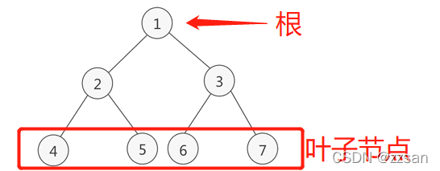

#### 树的深度（高度）

从一棵树的树根开始, 树根所在层为第一层, 根的孩子结点所在的层为第二层, 依次类推, 一棵树的深度（高度）是树中结点所在的最大的层次

#### 兄弟节点

都有相同的父结点的子结点

#### 阶

整棵树, 子节点最多的个数是 m, 那么这棵树就是 m 阶树。

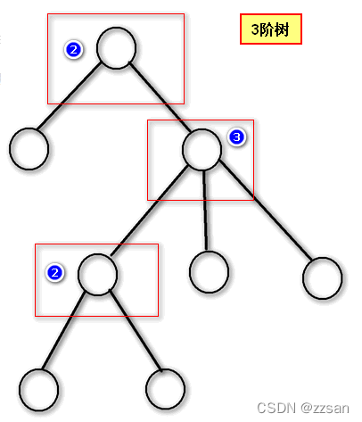

### 二叉树

满足以下两个条件的树:

1. 本身是有序树；
2. **树中包含的各个节点的度不能超过 2**, 即只能是 0、1 或者 2；
   > 拥有的子树数（结点有多少分支）称为结点的度（Degree）

二叉树的性质:

1. 二叉树中, 第 n 层最多有 2<sup>n</sup>-1 个结点。
2. 如果二叉树的深度为 n, 那么此二叉树最多有 2<sup>n</sup>-1 个结点。
3. 二叉树中, 终端结点数（叶子结点数）为 n<sub>0</sub>, 度为 2 的结点数为 n<sub>2</sub>, 则 n<sub>0</sub>=n<sub>2</sub>+1。

### 满二叉树

如果**二叉树**中除了叶子结点, 每个结点的度都为 **2**, 则此二叉树称为满二叉树

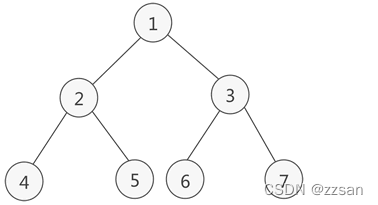

满二叉树的性质:

1. 满二叉树中第 n 层的节点数为 2<sup>n</sup>-1 个。
2. 深度为 n 的满二叉树必有 2<sup>n</sup>-1 个节点 , 叶子数为 2<sup>n</sup>-1。
3. 满二叉树中不存在度为 1 的节点, 每一个分支点中都两棵深度相同的子树, 且叶子节点都在最底层。
4. 具有 n 个节点的满二叉树的深度为 log<sub>2</sub>(n+1)

### 完全二叉树

如果**二叉树**中**除去最后一层节点**为满二叉树, 且**最后一层的结点依次从左到右分布**, 则此二叉树被称为完全二叉树。

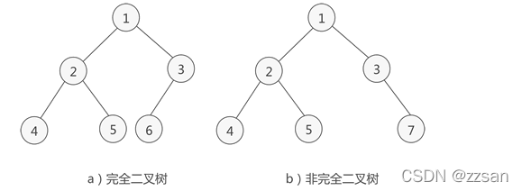

### 二叉排序树 / 二叉查找树

二叉排序树（Binary Sort Tree）, 又称二叉查找树（Binary Search Tree）
**一棵空树**, 或者是具有下列性质的**二叉树**
（1）若左子树不空, 则左子树上所有结点的值均**小于**或等于它的根结点的值；
（2）若右子树不空, 则右子树上所有结点的值均**大于**它的根结点的值；
（3）左、右子树也分别为**二叉排序树**；

### B 树

B-tree (中间的短线是英文连接符), 全称 Balance-tree(平衡多路查找树)

一颗 m 阶 B 树, **或为空树**, 或为满足下列特性的**m 叉树**。

1. 树中每个结点最多含有 m 棵子树;
2. 若根结点不是叶子结点, 则至少有两颗子树;
3. 除根结点之外的所有非叶子结点至少有 p 个子节点（**⌈m/2⌉ ≤ p ≤ m**, ⌈m/2⌉为向上取整, 也可以用 `ceil(m/2)` 表示）;
4. 所有的**非叶子结点**中包含以下数据：

   (
      $\color{#52c41a}{n}$, 
      $\color{#1890ff}{A_0}$, 
      $\color{#fa8c16}{K_1}$, 
      $\color{#1890ff}{A_1}$, 
      $\color{#fa8c16}{K_2}$,
      …, 
      $\color{#fa8c16}{K_n}$, 
      $\color{#1890ff}{A_n}$
   )
   > 1. ⌈m/2⌉ ≤ n ≤ m
   > 2. K<sub>i</sub>（1≤i≤n）为关键字, 且关键字按**升序**排序
   > 3. A<sub>i</sub>为 指向子树的指针, 且 A<sub>i-1</sub>指向的子树中所有结点的关键码均小于 K<sub>i</sub>, A<sub>n</sub>指向的子树中所有节点结点的关键码均大于 K<sub>i</sub> ( 即：每个数据 K<sub>i</sub>两旁的指针, 左边指针的结点的关键码均小于 K<sub>i</sub>, 右边指针的结点的关键码均大于 K<sub>i</sub>)

5. 所有的**叶子结点**都出现在同一层次上, 即所有叶节点具有相同的深度, 等于树高度。**并且不带信息**（可以看作是外部结点或查找失败的结点, 实际上这些结点不存在, 指向这些结点的指针为空）, 如下图所示

   > 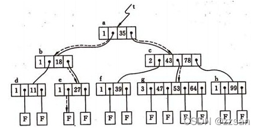

```go
type Node struct {
	KeyNum   int 		// 结点关键字个数
	Keys     KeyType    // 关键字数组, Keys[0]不使用
	parent   *Node       // 父结点
	children *Node       // 子结点
}
```

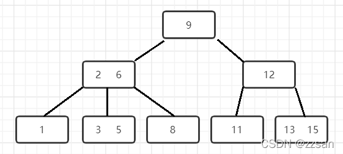

### B+树

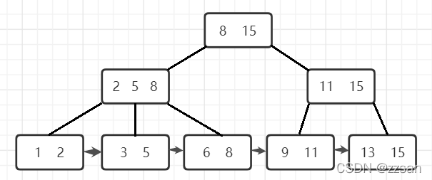

m 阶的 B+树的特征：

1.  有 k 个子树的中间节点包含有 k 个元素（B 树中是 k-1 个元素）, 每个元素不保存数据, 只用来索引, 所有数据都保存在叶子节点。

    > 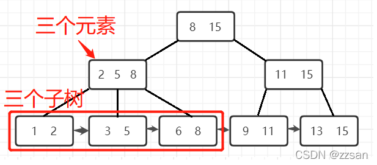

2.  所有的叶子结点中包含了全部元素的信息, 及指向含这些元素记录的指针, 且叶子结点本身依关键字的大小自小而大顺序链接。

    > 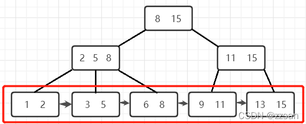

3.  所有的中间节点元素都同时存在于子节点, 在子节点元素中是最大（或最小）元素

    > 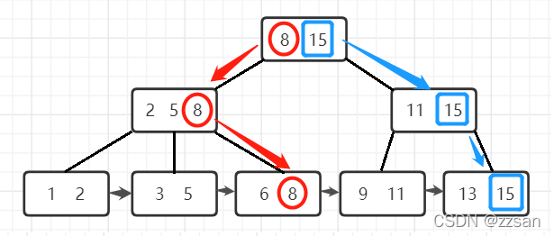

### B 树和 B+树的区别

1. B+树的**非叶子节点**不保存关键字记录的指针, 只进行数据索引, 这样使得 B+树每个非叶子节点所能保存的关键字大大增加；

   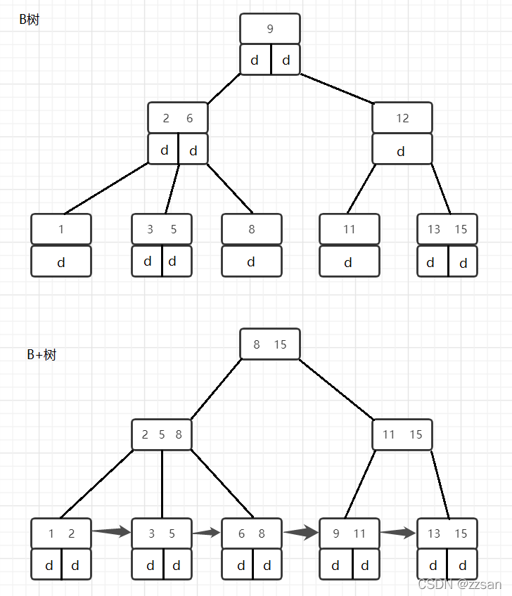
   
2. b+树查询必须查找到叶子节点, b 树只要匹配到即可不用管元素位置, 因此 b+树查找更稳定

**B+树的优势**

1. **层级更少**: 相较于 B 树 B+每个非叶子节点存储的关键字数更多, 树的层级更少所以查询数据更快；
2. **查询速度更稳定**: B+所有关键字数据地址都存在叶子节点上, 所以每次查找的次数都相同所以查询速度要比 B 树更稳定;
3. **排序功能**: B+树所有的叶子节点数据构成了一个有序链表, 在查询大小区间的数据时候更方便, 数据紧密性很高, 缓存的命中率也会比 B 树高。
4. **全节点遍历更快**: B+树遍历整棵树只需要遍历所有的叶子节点即可, 而不需要像 B 树一样需要对每一层进行遍历, 这有利于数据库做全表扫描。
5. **IO 次数更少**: 单一节点存储更多的元素, 使得查询的 IO 次数更少

## 二叉树的遍历

### 先序遍历

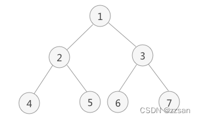

#### 遍历原则

根-左-右

1. 访问根节点
2. 访问当前节点的左子树
3. 若当前节点无左子树, 则访问当前节点的右子树

#### 遍历结果&解析

**结果**:
1 2 4 5 3 6 7

**解析**:

1. 访问根节点, 找到 节点 $\color{#1890ff}{1}$
2. 访问节点 1 的左子树, 找到节点 $\color{#1890ff}{2}$
3. 访问节点 2 的左子树, 找到节点 $\color{#1890ff}{4}$
4. 访问节点 4 左子树失败 => 访问节点 4 右子树失败 => **以节点 4 为根节点的子树** 遍历完成。回到**以节点 2 为根节点的子树**, 还没遍历其右子树, 开始遍历, 找到节点 $\color{#1890ff}{5}$
5. 访问节点 5 左子树失败 => 访问节点 5 右子树失败 => **以节点 5 为根节点的子树** 遍历完成 => **以节点 2 为根节点的子树**也遍历完成。回到**以节点 1 为根节点的子树**, 并遍历其右子树, 找到节点 $\color{#1890ff}{3}$
6. 访问节点 3 左子树, 找到节点 $\color{#1890ff}{6}$
7. 访问节点 6 左子树失败 => 访问节点 6 右子树失败 => **以节点 6 为根节点的子树** 遍历完成。**以节点 3 为根节点的子树** 还没有遍历其右子树, 因此现在开始遍历, 找到节点 $\color{#1890ff}{7}$
8. 访问节点 7 左子树失败 => 访问节点 7 右子树失败 => **以节点 7 为根节点的子树** 遍历完成 => 遍历完成因此以节点 3 为根节点的子树遍历完成, 同时回归节点 1。由于节点 1 的左右子树全部遍历完成, 因此整个二叉树 $\color{#52c41a}{遍历完成}$

### 中序遍历


#### 遍历原则

左-根-右

1. 访问当前节点的左子树
2. 访问根节点
3. 访问当前节点的右子树

#### 遍历结果&解析

**结果**:
4 2 5 1 6 3 7

**解析**:

1. 访问根节点, 找到节点 $\color{#fa8c16}{1}$
2. 遍历节点 1 的左子树, 找到节点 $\color{#fa8c16}{2}$
3. 遍历节点 2 的左子树, 找到节点 $\color{#fa8c16}{4}$
4. 节点 4 无左孩子, 因此找到节点 $\color{#1890ff}{4}$, 并遍历节点 4 的右子树
5. 节点 4 无右子树, 因此节点 2 的左子树遍历完成, 访问节点 $\color{#1890ff}{2}$
6. 遍历节点 2 的右子树, 找到节点 $\color{#fa8c16}{5}$
7. 节点 5 无左子树, 因此访问节点 $\color{#1890ff}{5}$ , 又因为节点 5 没有右子树, 因此节点 1 的左子树遍历完成, 访问节点 $\color{#1890ff}{1}$, 并遍历节点 1 的右子树, 找到节点 $\color{#fa8c16}{3}$
8. 遍历节点 3 的左子树, 找到节点 $\color{#fa8c16}{6}$
9. 节点 6 无左子树, 因此访问节点 $\color{#1890ff}{6}$, 又因为该节点无右子树, 因此节点 3 的左子树遍历完成, 开始访问节点 $\color{#1890ff}{3}$, 并遍历节点 3 的右子树, 找到节点 $\color{#fa8c16}{7}$
10. 节点 7 无左子树, 因此访问节点 $\color{#1890ff}{7}$, 又因为该节点无右子树, 因此节点 1 的右子树遍历完成, 即 $\color{#52c41a}{遍历完成}$

### 后序遍历


#### 遍历原则

左-右-根

1. 遍历当前节点的左子树
2. 遍历当前节点的右子树
3. 访问根节点

#### 遍历结果&解析

**结果**:
4 5 2 6 7 3 11

**解析**:

1. 从根节点 1 开始, 遍历该节点的左子树（以节点 2 为根节点）
2. 遍历节点 2 的左子树（以节点 4 为根节点）
3. 节点 4 无左右子树, 访问节点 $\color{#1890ff}{4}$, 回到节点 2 , 遍历节点 2 的右子树（以 5 为根节点）；
4. 节点 5 无左右子树, 访问节点 $\color{#1890ff}{5}$ , 节点 2 的左右子树也遍历完成, 访问节点 $\color{#1890ff}{2}$
5. 回到节点 1 , 开始遍历节点 1 的右子树（以节点 3 为根节点）
6. 遍历节点 3 的左子树（以节点 6 为根节点）
7. 节点 6 无左右子树, 访问节点 $\color{#1890ff}{6}$, 回节点 3, 开始遍历节点 3 的右子树（以节点 7 为根节点）
8. 节点 7 无左右子树, 访问节点 $\color{#1890ff}{7}$, 节点 3 的左右子树遍历完成, 访问节点 $\color{#1890ff}{3}$；节点 1 的左右子树遍历完成, 访问节点 $\color{#1890ff}{1}$, $\color{#52c41a}{遍历完成}$

### 层次遍历


#### 遍历原则

**按照二叉树中的层次从左到右依次遍历每层中的结点**。
实现思路是:
通过使用**队列**的数据结构, 从树的根结点开始, 依次将其左孩子和右孩子入队。
而后每次队列中一个结点出队, 都将其左孩子和右孩子入队, 直到树中所有结点都出队, 出队结点的先后顺序就是层次遍历的最终结果。

#### 遍历结果&解析

**结果**:
1 2 3 4 5 6 7

**解析**:

1. 根结点 1 入队

   > 队列内容: 1

2. 根结点 $\color{#1890ff}{1}$ 出队, 出队的同时, 将左孩子 2 和右孩子 3 分别入队

   > 队列内容: 2 3

3. 队头结点 $\color{#1890ff}{2}$ 出队, 出队的同时, 将结点 2 的左孩子 4 和右孩子 5 依次入队
   > 队列内容: 3 4 5
4. 队头结点 $\color{#1890ff}{3}$ 出队, 出队的同时, 将结点 3 的左孩子 6 和右孩子 7 依次入队
   > 队列内容: 4 5 6 7
5. 不断地循环, 直至队列内为空。

## 相关文档

[漫画：什么是 B+树？](https://zhuanlan.zhihu.com/p/54102723)
