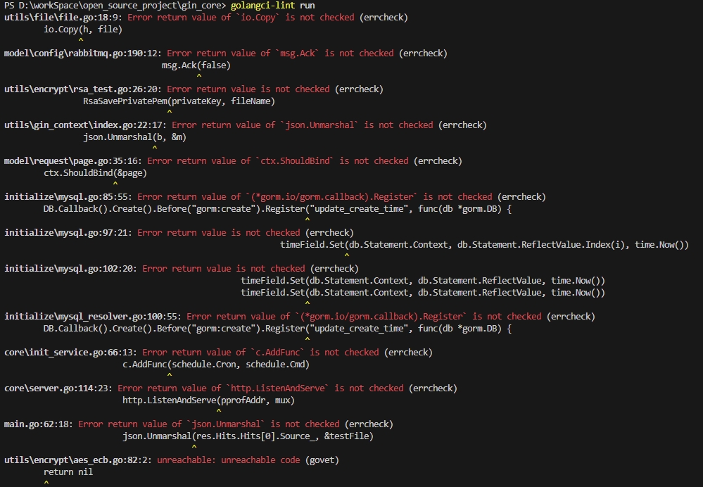
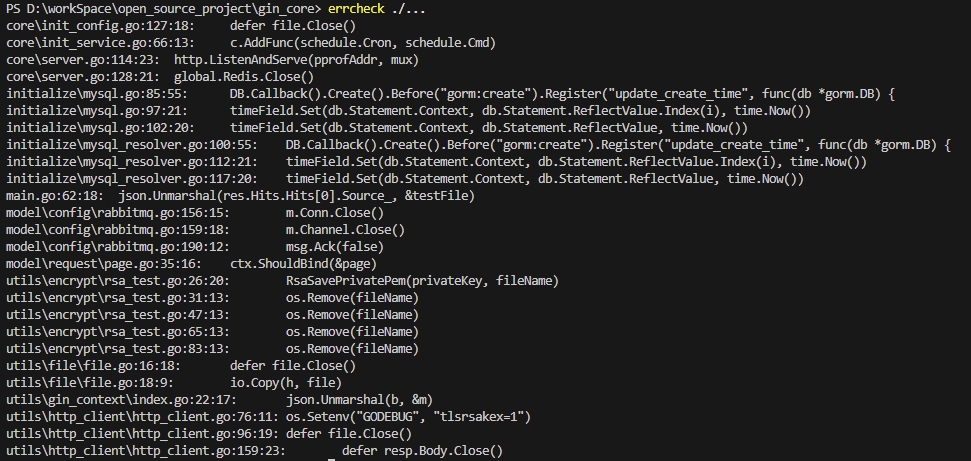

# golang代码分析检测工具

|工具|安装|指令|
|--|--|--|
|vet|-|`go vet ./...`|
|gofmt|-|`gofmt -w .`|
|golangci-lint|`go install github.com/golangci/golangci-lint/cmd/golangci-lint@latest`|`golangci-lint run`|
|staticcheck|`go install honnef.co/go/tools/cmd/staticcheck@latest`|`staticcheck ./...`|
|errcheck|`go install github.com/kisielk/errcheck@latest`|`errcheck ./...`|
|gocyclo|`go install github.com/fzipp/gocyclo@latest`|`gocyclo -over 10 .`|
|gosec|`go install github.com/securego/gosec/v2/cmd/gosec@latest`|`gosec ./...`|
|【已废弃】golint|`go install golang.org/x/lint/golint@latest`|`golint ./...`|

## 1. go vet
特点: golang **自带**的静态分析工具

安装：无需安装，golang自带

指令：`go vet ./...`

## 2. gofmt
特点: golang **自带**的静态分析工具

安装：无需安装，golang自带

指令：`gofmt -w .`

## 3. golangci-lint

特点: 集成多种静态分析工具（govet, errcheck等）

安装: `go install github.com/golangci/golangci-lint/cmd/golangci-lint@latest`

指令: `golangci-lint run`

其他：
1. [golangci-lint 仓库地址](https://github.com/golangci/golangci-lint)
2. [golangci-lint 文档地址](https://golangci-lint.run/)

## 4. staticcheck

安装: `go install honnef.co/go/tools/cmd/staticcheck@latest`

指令: `staticcheck ./...`

其他：
1. [staticcheck 仓库地址](https://github.com/dominikh/go-tools)
2. [staticcheck 文档地址](https://staticcheck.dev/docs/)

## 5. errcheck

安装: `go install github.com/kisielk/errcheck@latest`

指令: `errcheck ./...`

其他：
1. [errcheck 仓库地址](https://github.com/kisielk/errcheck)

## 6. gocyclo

安装: `go install github.com/fzipp/gocyclo@latest`

指令: `gocyclo -over 10 .`

其他：
1. [errcheck 仓库地址](https://github.com/fzipp/gocyclo)

## 7. gosec

安装: `go install github.com/securego/gosec/v2/cmd/gosec@latest`

指令: `gosec ./...`

其他：
1. [gosec 仓库地址](https://github.com/securego/gosec)
2. [gosec 文档地址](https://securego.io/)

## 8. 【已废弃】golint

安装: `go install golang.org/x/lint/golint@latest`

指令: `golint ./...`

其他：
1. [golint 仓库地址](https://go.googlesource.com/lint)
