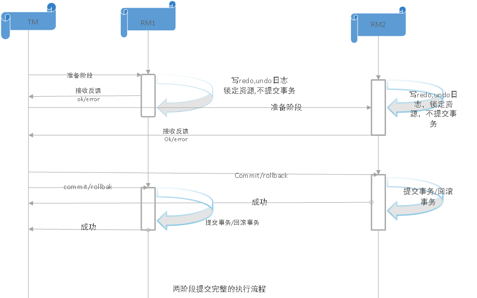
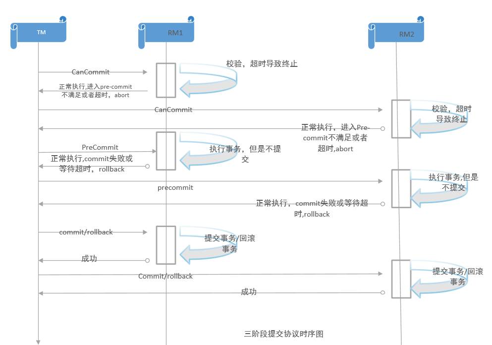

# 分布式事务

## 术语

`TM (Transaction Manager)` 事务管理器，负责协调和管理分布式事务的执行。在分布式系统中，多个应用程序可能需要访问和更新共享数据，但是保证数据的一致性是一个挑战。TM通过协调不同应用程序的操作，确保分布式事务的原子性、一致性、隔离性和持久性 (ACID属性) 。因此，TM也被称为协调器。

`RM (Resource Manager)` 资源管理器，负责管理和控制分布式系统中的资源。资源可以是数据库、消息队列、文件、网络连接等。RM通过与TM通信，实现对资源的锁定、解锁和提交等操作，以确保分布式事务的正确执行。因此，TM和RM通常一起使用，来描述分布式系统中的工作流程。
## 2PC 两阶段提交
两阶段提交(Two-Phase Commit)是一种原子性提交协议，它通过将事务的提交过程分为两个阶段来确保分布式事务的一致性。

### 阶段详情

1. **准备阶段 (Prepare phase)**

    `TM` 给每个 `RM` 发送Prepare消息, 每个数据库参与者在本地执行事务, 写redolog和undolog, 此时事务还没提交

2. **提交阶段 (Commit phase)**

    如果 `TM` 收到了 `RM` 的执行失败或者超时消息, 直接给每个 `RM` 发送回滚消息(rollback), 否则, 发送提交消息(Commit); `RM` 根据收到的消息, 执行提交或回滚操, 并释放事务过程中使用的锁资源。

### 异常情况
#### 超时
1. 第二步, `RM` 超时未收到 `TM` 的 commit/rollback, 此时 `RM` 会一直锁定资源等待第二步事务
    
    (1) 一直锁定资源

    (2) 超时confirm事务

    (3) 超时cancel事务

2. 第一步, `TM` 超时没收到回复, `TM`无法知道是否所有 `RM` 都成功锁定了资源

    (1) 超时重试，即超过发起事务

    (2) 当返回失败处理

    组合使用，如：多次超时重试后，当失败处理

3. 第二步, `TM` 超时未收到回复, `TM` 无法知道是否所有 `RM` 都成功commit/rollback了事务

    (1) 超时重试，即超过发起事务

    (2) 当返回失败处理

    但可能会出现数据不一致的情况，此时可能需要人工干预

#### 异常

1. 第一步发生异常
    (1) 对 `TM` 而言：部分 `RM` 锁定了资源，而另一部分从未收到过事务请求。由于 `RM` 会默认超时 cancel，所以 `TM` 发起 cancel 后（或不处理，直接等待超时）重新发起新事务即可。
    (2) 对 `RM` 而言：尽量返回失败即可，超时 `TM` 会重试cancel 请求。不会有风险。

2. 第二步发生异常
    (1) 对 `TM` 而言：如果执行的是 cancel，则无需重试，当做成功即可（当然也可以重试）。如果执行的是 confirm，则可能发生部分机器成功 confirm，部分机器由于没有收到 confirm，默认超时 cancel 请求，从而数据不一致的风险。
    (2) 对 `RM` 而言：尽量重试并保证成功。如果执行的是 confirm，说明第一步的锁定返回了成功，所以第二步的确认只能是成功。如果是 cancel，则更应当自行重试保证资源释放。

### 缺点

2PC 协议可以确保分布式事务的原子性和一致性，但是其效率较低，可能会出现阻塞等问题。
两阶段提交存在以下几个问题：

1. **同步阻塞问题**

  执行过程中，所有参与节点都是事务阻塞型的。当参与者占有公共资源时，其他第三方节点访问公共资源不得不处于阻塞状态。也就是说从投票阶段到提交阶段完成这段时间，资源是被锁住的。

2. **单点故障**
  
  由于协调者的重要性，一旦协调者发生故障。参与者会一直阻塞下去。尤其在第二阶段，协调者发生故障，那么所有的参与者还都处于锁定事务资源的状态中，而无法继续完成事务操作。
  
3. **数据不一致问题**
  
  在 2PC 最后提交阶段中，当协调者向参与者发送 commit 请求之后，发生了局部网络异常或者在发送 commit 请求过程中协调者发生了故障，这会导致只有一部分参与者接受到了 commit 请求。而在这部分参与者接到 commit 请求之后就会执行 commit 操作。但是其他部分未接到 commit 请求的机器则无法执行事务提交，于是整个分布式系统便出现了数据不一致性的现象。

## 3PC 三阶段提交
三阶段提交 (Three-Phase Commit) 是在 2PC 协议的基础上添加了一个额外的阶段 (`CanCommit`) , 使 `RM` 能够在 CanCommit 阶段发现并解决可能导致阻塞的问题, 并减少不必要的等待时间, 3PC 协议能够更快地执行提交或回滚事务, 来解决 2PC 协议可能出现的阻塞问题。

### 相比2PC
1. **引入了超时机制**，同时在 `TM` 和 `RM` 中都引入超时机制（2PC 只有`TM` 有超时机制）；
2. **增加了 CanCommit 阶段**，可以尽早的发现问题，从而避免了后续的阻塞和无效操作。

### 阶段详情

1. **CanCommit 阶段 (询问阶段)**
  
    在这个阶段，`TM` 向所有 `RM` 发出 `CanCommit` 请求，询问它们是否准备好提交事务。 `RM` 执行所有必要的操作，并回复协调者它们是否可以提交事务。

2. **PreCommit 阶段 (准备阶段) **
    
    如果所有 `RM` 都回复可以提交事务，则 `TM` 将向所有 `RM` 发送 `PreCommit` 请求，通知它们准备提交事务。 `RM` 执行所有必要的操作，并回复 `TM` 它们是否已经准备好提交事务。

3. **DoCommit 阶段 (提交阶段) **
    
    如果所有 `RM` 都已经准备好提交事务，则 `TM` 将向所有 `RM` 发送 `DoCommit` 请求，通知它们提交事务。 `RM` 执行所有必要的操作，并将其结果记录在持久性存储中。一旦所有 `RM` 都已提交事务，`TM` 将向它们发送确认请求。如果任何 `RM` 未能提交事务，则 `TM` 将通知所有 `RM` 回滚事务。