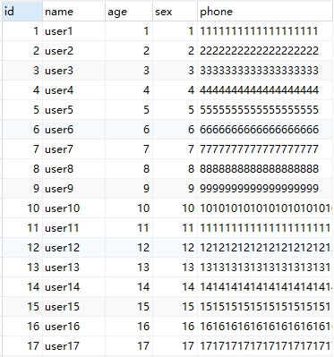

# mysql索引基本知识梳理
## 索引介绍
官方介绍索引是帮助MySQL高效获取数据的数据结构, 原理为**以空间换时间**, mysql的索引采用的是[B+树](../algorithm/tree/README.md#b树)的结构

### 索引的优缺点
优点：
* 提高查询效率
* 降低数据库IO成本
* 通过索引对数据进行排序, 降低排序成本, 降低CPU消耗

缺点：
* 索引会占用磁盘空间
* 降低更新表的效率
    >对数据进行增删改操作时, 除了保存数据外, 还要更新索引文件, 且耗时随着数据量增加而增加

### 索引类型
1. 主键索引 primary key
索引列中的值必须是唯一的, 不允许有空值。

2. 唯一索引 unique
索引列中的值必须是唯一的, 但是允许为空值。

3. 普通索引 normal
MySQL中基本索引类型, 没有什么限制, 允许在定义索引的列中插入重复值和空值。

4. 全文索引 Full Text
只能在文本类型**CHAR,VARCHAR,TEXT**类型字段上创建全文索引。**字段长度比较大时, 如果创建普通索引, 在进行like模糊查询时效率比较低, 这时可以创建全文索引**。 MyISAM和InnoDB中都可以使用全文索引。

5. 空间索引 spatial
MySQL在5.7之后的版本支持了空间索引, 而且支持OpenGIS几何数据模型。MySQL在空间索引这方面遵循OpenGIS几何数据模型规则。

6. 前缀索引
在文本类型如CHAR,VARCHAR,TEXT类列上创建索引时, 可以指定索引列的长度, 但是数值类型不能指定。

7. 其他（按照索引列数量分类）
    * 单列索引
    * 组合索引
        >组合索引的使用, 需要遵循最左前缀匹配原则（最左匹配原则）。一般情况下在条件允许的情况下使用组合索引替代多个单列索引使用。

## 索引的创建和使用
假设以用户基本信息表为例, 表结构如下:

|名|类型|长度|小数点|不是null|虚拟|键|注释
|--|--|--|--|--|--|--|--|
|id|int|0|0|[x]|[ ]|Y| id|
|name|varchar|255|0|[x]|[ ]||姓名|
|age|int|0|0|[x]|[ ]||年龄|
|sex|tinyint|1|0|[x]|[ ]||性别|
|phone|varchar|255|0|[x]|[ ]||电话|


``` sql
-- 创建表时, 创建索引
CREATE TABLE `user` (
  `id` int NOT NULL COMMENT 'id',
  `name` varchar(255) COLLATE utf8mb4_bin NOT NULL COMMENT '姓名',
  `age` int NOT NULL COMMENT '年龄',
  `sex` tinyint(1) NOT NULL COMMENT '性别',
  `phone` varchar(255) COLLATE utf8mb4_bin NOT NULL COMMENT '电话',
  PRIMARY KEY (`id`)
) ENGINE=InnoDB DEFAULT CHARSET=utf8mb4 COLLATE=utf8mb4_bin;


```
### 查看表索引
``` sql
SHOW INDEX FROM 【tableName】;

-- 就例子中的user表, 具体sql如下：
-- SHOW INDEX FROM user;
```
索引结果如下：
|Table|Non_unique|Key_name|Seq_in_index|Column_name|Collation|Cardinality|Sub_part|Packed|Null|Index_type|Comment|Index_comment|Visible|Expression|
|--|--|--|--|--|--|--|--|--|--|--|--|--|--|--|
|user|0| $\color{#f56c6c}{PRIMARY}$ |1|id|A|0| $\color{#909399}{(Null)}$ | $\color{#909399}{(Null)}$ ||BTREE|||YES| $\color{#909399}{(Null)}$ |
>* Non_unique 是否非唯一, 这里说明主键也是唯一键
>* Key_name 主键索引名称默认为`PRIMARY`
>* Seq_in_index 索引序号递增
>* Column_name 为索引所在列明
>* Index_type 索引数据类型为B树（说明：是B+树）


### 单列索引
1. 创建普通索引

    ``` sql
    CREATE INDEX 【indexName】 ON 【tableName】(【columnName】);

    -- 就例子中的user表, 对name字段添加索引, 具体sql如下：
    -- CREATE INDEX idx_name ON user(name);
    ```

    |Table|Non_unique|Key_name|Seq_in_index|Column_name|Collation|Cardinality|Sub_part|Packed|Null|Index_type|Comment|Index_comment|Visible|Expression|
    |--|--|--|--|--|--|--|--|--|--|--|--|--|--|--|
    |user|0|PRIMARY|1|id|A|0| $\color{#909399}{(Null)}$ | $\color{#909399}{(Null)}$ ||BTREE|||YES| $\color{#909399}{(Null)}$ |
    |user|1| $\color{#f56c6c}{idx\_name}$ |1|name|A|0| $\color{#909399}{(Null)}$ | $\color{#909399}{(Null)}$ ||BTREE|||YES| $\color{#909399}{(Null)}$ |
    > * Non_unique 是否非唯一, 这里说明普通索引不是唯一

2. 创建唯一索引

    ``` sql
    CREATE UNIQUE INDEX 【indexName】 ON 【tableName】(【columnName】);

    -- 就例子中的user表, 对phone字段添加唯一索引, 具体sql如下：
    -- CREATE UNIQUE INDEX idx_phone ON user(phone);
    ```
    |Table|Non_unique|Key_name|Seq_in_index|Column_name|Collation|Cardinality|Sub_part|Packed|Null|Index_type|Comment|Index_comment|Visible|Expression|
    |--|--|--|--|--|--|--|--|--|--|--|--|--|--|--|
    |user|0|PRIMARY|1|id|A|0| $\color{#909399}{(Null)}$ | $\color{#909399}{(Null)}$ ||BTREE|||YES| $\color{#909399}{(Null)}$ |
    |user|0| $\color{#f56c6c}{idx\_phone}$ |1|phone|A|0| $\color{#909399}{(Null)}$ | $\color{#909399}{(Null)}$ ||BTREE|||YES| $\color{#909399}{(Null)}$ |
    > * Non_unique 是否非唯一, 唯一索引肯定是唯一


### 联合索引
#### 创建索引

``` sql
CREATE UNIQUE INDEX 【indexName】 ON 【tableName】(【columnName1】,【columnName2】,...,【columnNameN】);

-- 就例子中的user表, 对name和age和sex字段添加联合索引, 具体sql如下：
-- CREATE INDEX idx_name_age_sex ON user(name, age, sex);
```
|Table|Non_unique|Key_name|Seq_in_index|Column_name|Collation|Cardinality|Sub_part|Packed|Null|Index_type|Comment|Index_comment|Visible|Expression|
|--|--|--|--|--|--|--|--|--|--|--|--|--|--|--|
|user|0|PRIMARY|1|id|A|0| $\color{#909399}{(Null)}$ | $\color{#909399}{(Null)}$ ||BTREE|||YES| $\color{#909399}{(Null)}$ |
|user|1| $\color{#f56c6c}{idx\_name\_age\_sex}$ | $\color{#f56c6c}{1}$ |name|A|0| $\color{#909399}{(Null)}$ | $\color{#909399}{(Null)}$ ||BTREE|||YES| $\color{#909399}{(Null)}$ |
|user|1| $\color{#f56c6c}{idx\_name\_age\_sex}$ | $\color{#f56c6c}{2}$ |age|A|0| $\color{#909399}{(Null)}$ | $\color{#909399}{(Null)}$ ||BTREE|||YES| $\color{#909399}{(Null)}$ |
|user|1| $\color{#f56c6c}{idx\_name\_age\_sex}$ | $\color{#f56c6c}{3}$ |sex|A|0| $\color{#909399}{(Null)}$ | $\color{#909399}{(Null)}$ ||BTREE|||YES| $\color{#909399}{(Null)}$ |
    
> * 由结果可看出, 联合索引是多行数据存在数据库中, 且Seq_in_index是按顺序递增的

#### 联合索引的意义
1. 减少开销

    建一个联合索引(col1,col2,col3)，实际相当于建了(col1),(col1,col2),(col1,col2,col3)三个索引。每多一个索引，都会增加写操作的开销和磁盘空间的开销。对于大量数据的表，使用联合索引会大大的减少开销！

2. 覆盖索引

    对联合索引(col1,col2,col3)，如果有如下的sql: `select col1,col2,col3 from tableName where col1=1 and col2=2`。那么MySQL可以直接通过便利索引取得数据，**无需回表，较少io操作**。实际应用中，**覆盖索引是主要的提升性能的优化手段之一。**

3. 效率高

    索引列越多，通过索引筛选出来的数据越少。

    假设有1000w数据，`select col1,col2,col3 from tableName where col1=1 and col2=2 and col3=3`, 假设每个条件可筛选出10%的数据，如果使用单列索引，假设索引列为col1，则筛选出来的数据为 `1000w * 10 % = 100w` 条数据，然后再回表从100w条数据中找到符合剩下条件的数据，再进行排序和分页等操作。但如果是联合索引，通过索引直接能筛选出 `1000w * 10% * 10% * 10% = 1w` 条数据，性能有明显提升。


### 最左前缀匹配
在谈最左前缀匹配前, 可先了解mysql中[explain](./explain.md)的用法。

下列实例中, 表结构为：
``` sql
CREATE TABLE `user` (
  `id` int NOT NULL COMMENT 'id',
  `name` varchar(255) COLLATE utf8mb4_bin NOT NULL COMMENT '姓名',
  `age` int NOT NULL COMMENT '年龄',
  `sex` tinyint(1) NOT NULL COMMENT '性别',
  `phone` varchar(255) CHARACTER SET utf8mb4 COLLATE utf8mb4_bin NOT NULL COMMENT '电话',
  PRIMARY KEY (`id`),
  KEY `idx_name_age_sex` (`name`,`age`,`sex`)
) ENGINE=InnoDB DEFAULT CHARSET=utf8mb4 COLLATE=utf8mb4_bin;
```
先往user表中插入若干数据, 如下图：



1. 全值匹配

    **符合最左前缀匹配原则**

    ``` sql
    select * from user where name = ? and age = ? and sex = ?
    select * from user where name = ? and sex = ? and age = ?
    select * from user where age = ? and name = ? and sex = ?
    select * from user where age = ? and sex = ? and name = ?
    ```
        
    |id|select_type|table|partitions|type|possible_keys|key|key_len|ref|rows|filtered|Extra|
    |--|--|--|--|--|--|--|--|--|--|--|--|
    |1|SIMPLE|user| $\color{#909399}{(Null)}$ |ref|idx_name_age_sex|idx_name_age_sex|1027|const,const,const|1|100.00| $\color{#909399}{(Null)}$ |

    sql语句中字段的顺序不需要和联合索引定义的字段顺序相同, 查询优化器会判断纠正这条SQL语句以什么样的顺序执行效率高, 最后才能生成真正的执行计划
    

2. 匹配最左边的列

    **符合最左前缀匹配原则**

    ``` sql
    select * from user where name = ? 
    ```

    |id|select_type|table|partitions|type|possible_keys|key|key_len|ref|rows|filtered|Extra|
    |--|--|--|--|--|--|--|--|--|--|--|--|
    |1|SIMPLE|user| $\color{#909399}{(Null)}$ |ref|idx_name_age_sex|idx_name_age_sex|1022|const|1|100.00| $\color{#909399}{(Null)}$ |
    > 只是name命中索引时, key_len为1022

    ---

    ``` sql
    select * from user where name = ? and age = ?
    ```

    |id|select_type|table|partitions|type|possible_keys|key|key_len|ref|rows|filtered|Extra|
    |--|--|--|--|--|--|--|--|--|--|--|--|
    |1|SIMPLE|user| $\color{#909399}{(Null)}$ |ref|idx_name_age_sex|idx_name_age_sex|1026|const|1|100.00| $\color{#909399}{(Null)}$ |
    > name和age命中索引时, key_len为1026, 比仅name命中时, key_len大4, 是因为int的长度是4个字节

    ---

    ``` sql
    select * from user where name = ? and sex = ?
    ```

    |id|select_type|table|partitions|type|possible_keys|key|key_len|ref|rows|filtered|Extra|
    |--|--|--|--|--|--|--|--|--|--|--|--|
    |1|SIMPLE|user| $\color{#909399}{(Null)}$ |ref|idx_name_age_sex|idx_name_age_sex|1022|const|1|100.00|Using index condition|

3. 匹配列前缀
    
    对于字符串类型, **模糊匹配中的前缀匹配, 用的是索引, 中缀和后缀走的全表扫描**

    * 前缀匹配 -- **走索引**

        ```sql
        explain select * from user where name like 'user1%';
        ```
        |id|select_type|table|partitions|type|possible_keys|key|key_len|ref|rows|filtered|Extra|
        |--|--|--|--|--|--|--|--|--|--|--|--|
        |1|SIMPLE|user| $\color{#909399}{(Null)}$ |ref|idx_name_age_sex|idx_name_age_sex|1022|const|11|100.00|Using index condition|
    
    * 中缀匹配 -- **不走索引**

        ```sql
        explain select * from user where name like '%user1%';
        ```
        |id|select_type|table|partitions|type|possible_keys|key|key_len|ref|rows|filtered|Extra|
        |--|--|--|--|--|--|--|--|--|--|--|--|
        |1|SIMPLE|user| $\color{#909399}{(Null)}$ |ALL| $\color{#909399}{(Null)}$ | $\color{#909399}{(Null)}$ | $\color{#909399}{(Null)}$ | $\color{#909399}{(Null)}$ |99|11.11|Using where|


    * 后缀匹配 -- **不走索引**

        ```sql
        explain select * from user where name like '%user1';
        ```
        |id|select_type|table|partitions|type|possible_keys|key|key_len|ref|rows|filtered|Extra|
        |--|--|--|--|--|--|--|--|--|--|--|--|
        |1|SIMPLE|user| $\color{#909399}{(Null)}$ |ALL| $\color{#909399}{(Null)}$ | $\color{#909399}{(Null)}$ | $\color{#909399}{(Null)}$ | $\color{#909399}{(Null)}$ |99|11.11|Using where|

4. 匹配范围值

    ```sql
    explain select * from user where id > 1;
    ```
    |id|select_type|table|partitions|type|possible_keys|key|key_len|ref|rows|filtered|Extra|
    |--|--|--|--|--|--|--|--|--|--|--|--|
    |1|SIMPLE|user| $\color{#909399}{(Null)}$ |range|PRIMARY|PRIMARY|4| $\color{#909399}{(Null)}$ |98|100.00|Using where|

    > 最左前缀匹配原则遇到<>, 就会停止匹配, 但是由于id本身是有序的, 由上述结果可知, 该查询使用了id索引, 且为range范围查询

    ---

    ```sql
    explain select * from user where id > 1 and age < 10
    ```
    |id|select_type|table|partitions|type|possible_keys|key|key_len|ref|rows|filtered|Extra|
    |--|--|--|--|--|--|--|--|--|--|--|--|
    |1|SIMPLE|user| $\color{#909399}{(Null)}$ |range|PRIMARY|PRIMARY|4| $\color{#909399}{(Null)}$ |98|33.33|Using where|

    > 由于不遵循最左匹配原则，使用的是range扫描。

