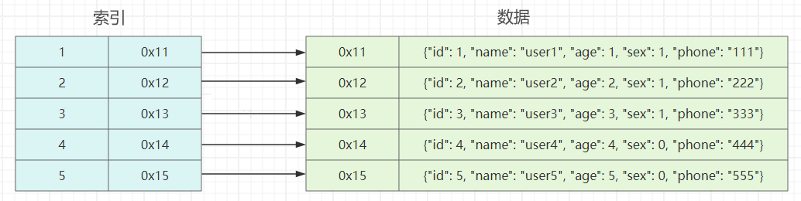
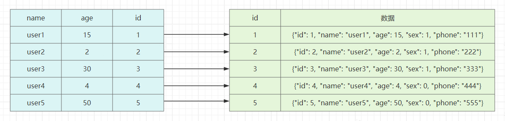
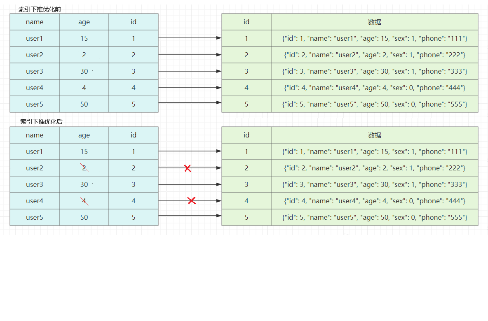

# mysql索引原理

文中的查询, 以该表结构为例
``` sql
CREATE TABLE `user` (
  `id` int NOT NULL COMMENT 'id',
  `name` varchar(255) COLLATE utf8mb4_bin NOT NULL COMMENT '姓名',
  `age` int NOT NULL COMMENT '年龄',
  `sex` tinyint(1) NOT NULL COMMENT '性别',
  `phone` varchar(255) CHARACTER SET utf8mb4 COLLATE utf8mb4_bin NOT NULL COMMENT '电话',
  PRIMARY KEY (`id`),
  UNIQUE KEY `idx_phone` (`phone`),
  KEY `idx_name` (`name`),
  KEY `idx_name_age_sex` (`name`,`age`,`sex`)
) ENGINE=InnoDB DEFAULT CHARSET=utf8mb4 COLLATE=utf8mb4_bin;
```




在没有索引的情况下, 如果需要查询id为1的数据, 需要进行全表扫描。而通过索引, 查询id为1的数据, 可通过索引快速定位到该数据的地址, 从而快速查询到该数据。

## 数据结构
mysql的索引是以[B+树](/algorithm/tree/README.md#b树)作为索引的结构

为什么是B+树, 而不是B-树？下图为B-树和B+树的数据结构示意图：


两者区别在于：
|差异|B-树|B+树|
|--|--|--|
|指向具体数据的指针|所有节点都有|只有叶子节点有|
|叶子节点是否连接|不连接|通过指针连接|
|效率稳定性|可能在非叶子节点拿到数据的指针, 效率不稳定|必须到叶子节点才能拿到数据的指针, 效率稳定|

由于上述差异, 可以得出：
1. B+树中, 非叶子节点不存数据的指针, 故可储存更多索引项, 可以降低树都高度, 从而提高搜索效率
2. B+树中, 叶子节点连接在一起, 范围搜索时, 在叶子节点间移动即可, B-树则需要在叶子节点和非叶子节点之间来回反复移动


## 聚簇索引和非聚簇索引

索引按物理存储方式分, 可分为聚簇索引和非聚簇索引。

主键索引是聚簇索引, 其他索引都是非聚簇索引。使用的数据结构都是B+树, 差别在于：
1. 聚簇索引的叶子节点存储的数据是完整数据
2. **非聚簇索引的叶子节点存储的是主键值**, 故也成为二级索引或辅助索引。

故查询时, 
1. 用的聚簇索引
    
    当用的是聚簇索引的时候, 直接查询主键索引的B+树即可获取到数据

2. 用的非聚簇索引

    * 查询列都在索引内, 查询非聚簇索引的B+树, 即可获取所需数据
    * 查询列不全在索引内, 先搜索非聚簇索引的B+树, 获取主键值, 再搜索聚簇索引的B+树, 从而获得最终数据, **在流程中从非主键索引树搜索回到主键索引树搜索的过程称为：回表**

查询时，**走不走索引取决于成本**。其中，这部分成本包括：

* 读取非聚簇索引的成本
* 根据非聚簇索引获取到的主键，回表查询的成本

当走索引的成本超过了全表扫描的成本，这时候就不走索引了


### 覆盖索引
常规来说, 大部分场景使用的都是非聚簇索引查询, 为了提高查询效率, 减少IO开销, 常用到的优化思路, 就是**减少回表**。
就是把单列的非主键索引修改为多字段的联合索引, 在一棵索引数上。就找到了想要的数据, 不需要去主键索引树上,再检索一遍 这个现象,称之为 **索引覆盖**.

### 索引下推优化
假设, 现需要查询name为以user开头, 年龄大于10, 性别为1的数据, 则sql如下：
``` sql
select * from user where name like 'user%' and age > 10 and sex = 1
```
由于最左前缀匹配原则, 只能匹配到第一个以user开头的数据, 如下图：



接下来的处理逻辑：从id为1的数据开始逐个回表对比age和sex是否符合要求。
但引入**索引下推优化**后, 可以在索引遍历的过程中, 对索引中的字段先做判断, 过滤掉不符合要求的数据, 减少回表次数



如果没有索引下推优化(或称ICP优化), 当进行索引查询时, 首先根据索引来查找记录, 然后再根据where条件来过滤记录；在支持ICP优化后, MySQL会在取出索引的同时, 判断是否可以进行where条件过滤再进行索引查询, 也就是说提前执行where的部分过滤操作, 在某些场景下, **可以大大减少回表次数, 从而提升整体性能**。

## 参考文档
[这篇 MySQL 索引和 B+Tree 讲得太通俗易懂](https://zhuanlan.zhihu.com/p/293128007)