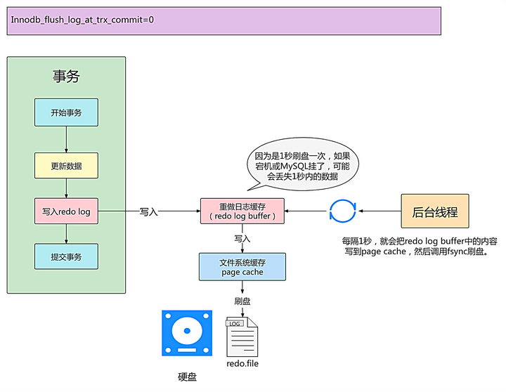
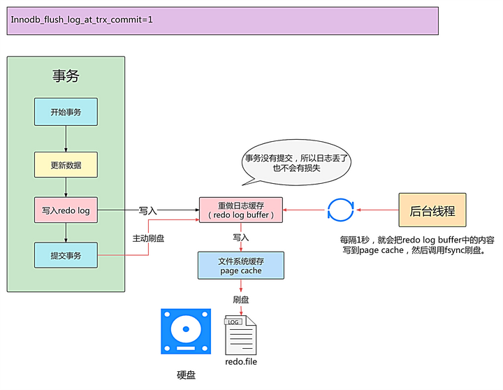
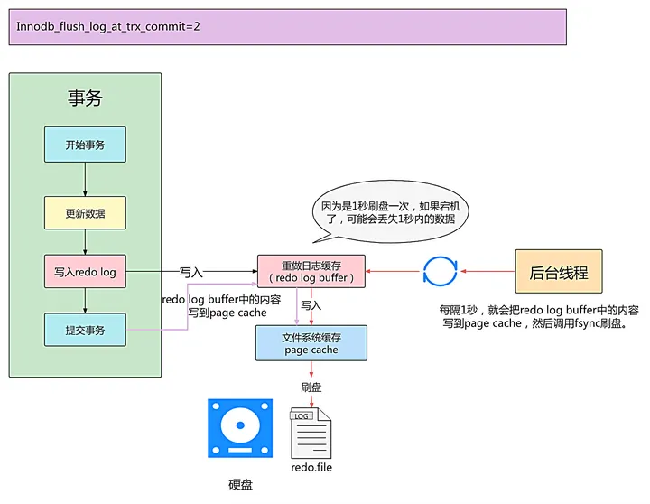

# `redo log`和`undo log`
1. `redo log`通常是物理日志，记录的是数据页的物理修改，而不是某一行或某几行修改成怎样怎样，它用来恢复提交后的物理数据页(恢复数据页，且只能恢复到最后一次提交的位置)。
2. `undo log`用来回滚行记录到某个版本。undo log一般是逻辑日志，根据每行记录进行记录。

> `undo log` 不是 `redo log`的逆向过程
`redo log`和`undo log`是innodb引擎独有的

## redo log 刷盘
### 基本概念
redo log包括两部分：
* 内存中的日志缓冲（redo log buffer），该部分日志容易丢失
* 磁盘上的重做日志文件（redo log file），该部分数据是持久的

innodb是以页为单位来进行磁盘io，页的默认大小是16KB，查询一条数据时，也是会把一页的数据加载出来，放入buffer pool中，后续查询会先从buffer pool中找，没命中再去硬盘加载，减少硬盘io开销以达到提高性能。

为了确保每次日志成功落盘，每次将`log buffer`中的日志写入日志文件的过程中，都需要调用一次操作系统的`fsync`操作。要写入`log file`，中间需要经过操作系统内核空间的`os buffer`，调用`fsync`的作用是将`os buffer`中的日志刷到磁盘上的`log file`中，大概过程如下：

### 刷盘策略
`redo log`的写入为了减少刷盘频率需要先写入内存的`redo log buffer`中，之后以一定的频率将buffer刷入到磁盘的`redo log`文件中去。
InnoDB 存储引擎使用 `innodb_flush_log_at_trx_commit` 参数配置:

|取值|策略|优点|缺点|
|--|--|--|--|
|0|每次事务提交时不进行刷盘操作，由master线程每隔1s进行一次刷盘。|IO效率高于1，低于2|db或os宕机会丢失1s数据|
|1|每次事务提交时都将进行刷盘操作（**默认值**）|不会丢数据|效率最低|
|2|每次事务提交时都只把 `redo log buffer` 内容写入 `page cache`，由OS决定什么时候同步到磁盘文件中|io效率最高，仅db宕机不会丢数据|os宕机会丢失1s数据|

#### innodb_flush_log_at_trx_commit=0

事务过程中，`redo log`写入`redo log buffer`中，由master线程每隔1s将buffer中的内容写入操作系统的`page cache`中，并调用`fsync`将`page cache`刷到磁盘。MySQL宕机会造成1s的事务丢失

#### innodb_flush_log_at_trx_commit=1 （**默认值**）

* 事务提交时，主动刷盘`redo log buffer`的内容立刻同步到磁盘文件中，操作系统宕机不会丢失数据；
* 事务未提交时，操作系统宕机`redo log buffer`丢失也不会有损失，因为事务未提交不会持久化。

#### innodb_flush_log_at_trx_commit=2

事务提交就将`redo log buffer`中的内容写入`page cache`缓存，由操作系统决定什么时候将`page cache`的内容写入磁盘。此时MySQL宕机并不会丢失数据，但是操作系统宕机会丢失这1s的数据。

## undo log
`undo log`有两个作用：**提供回滚** 和 **多版本控制(MVCC)**。

在数据修改的时候，不仅记录了redo，还记录了相对应的undo，如果因为某些原因导致事务失败或回滚了，可以借助该undo进行回滚。

undo log和redo log记录物理日志不一样，它是逻辑日志。**可以认为当delete一条记录时，undo log中会记录一条对应的insert记录，反之亦然，当update一条记录时，它记录一条对应相反的update记录**。

当执行rollback时，就可以从undo log中的逻辑记录读取到相应的内容并进行回滚。有时候应用到行版本控制的时候，也是通过undo log来实现的：当读取的某一行被其他事务锁定时，它可以从undo log中分析出该行记录以前的数据是什么，从而提供该行版本信息，让用户实现非锁定一致性读取。

## 相关文档
[MySQL日志之redo log](https://zhuanlan.zhihu.com/p/640120229)
> 刷盘策略，日志文件组介绍

[大厂基本功 | MySQL 三大日志 ( binlog、redo log 和 undo log ) 的作用？](https://zhuanlan.zhihu.com/p/667283776)

[MySQL数据落盘原理(data page、redo log、undo log、binlog、xa-2pc等源码分析)](https://blog.csdn.net/weixin_38597669/article/details/130668250)
> 含源码解读，比较硬核，有基础的同学可以看看