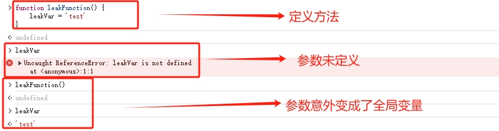

# 内存泄漏
## 概念
在JavaScript中，内存泄漏是指应用程序在不再需要使用某块内存时仍然保持对其的引用，导致内存不能被垃圾回收机制释放，最终导致内存占用过高，性能下降。

内存泄漏通常发生在以下情况：
* **全局变量**：全局变量会一直存在于内存中，即使在不需要时也无法被垃圾回收机制回收。
未清理的定时器和回调函数：如果定时器或回调函数没有正确清理，它们将一直存在于内存中，即使它们已经完成或不再需要了。
* **DOM引用**：当从DOM中删除元素时，如果仍然保持对该元素的引用，它将会在内存中留下无法释放的引用。
* **闭包**：如果函数创建了一个闭包（即函数内部引用了外部函数的变量），并且闭包没有在正确的时机释放，这将导致外部函数的变量一直无法被垃圾回收。


为了避免内存泄漏，可以采取以下措施：

* **使用局部变量**：在函数内部尽量使用局部变量而不是全局变量，以便在函数执行完毕后可以被垃圾回收。
* **显式清理**：在不再需要使用的定时器、回调函数和DOM引用时，手动清理它们，例如通过使用clearTimeout()清除定时器。
* **解除闭包**：在不需要使用闭包时，手动解除对外部函数变量的引用，以便垃圾回收机制可以释放内存。
* **使用垃圾回收器**：JavaScript具有自动的垃圾回收机制，可以自动释放不再需要的内存。通过确保代码的正确性和效率，可以帮助垃圾回收器更好地工作。


## 常见的内存泄漏

### 全局变量

1. 意外的全局变量
    ``` javascript
    function leakFunction() {
      leakVar = 'test'
    }
    ```

    

    **解决方法**： `use strict` 启用严格模式，严格模式会阻止创建意外的全局变量

2. 全局变量未释放
    
    全局变量未释放也会导致内存泄漏，可通过将变量置为`null`释放全局变量，避免内存泄漏

    ``` javascript
    // 未释放的全局变量
    var globalVar = 'Hello'

    function doSomething() {
    // ...
    }

    // 忘记释放全局变量

    // 可通过以下方式释放
    // globalVar = null
    // doSomething = null
    ```

### 闭包

[闭包](closure.md) 中被访问的参数和变量不会被JavaScript的垃圾回收机制回收，会导致内存泄漏，可通过将变量置为`null`释放全局变量，避免内存泄漏

``` javascript
function createClosure() {
  var value = 'Hello'

  // 创建一个闭包函数
  function closureFunction() {
    console.log(value)
  }

  // 返回闭包函数
  return closureFunction
}

// 创建闭包
var closure = createClosure()

// 闭包持有外部变量的引用，可能导致内存泄漏

// 可通过以下方式释放
// closure = null
```

### 定时器未清理

未清理定时器也会导致内存泄漏，可通过`clearInterval`清理定时器，避免内存泄漏
``` javascript
// 创建一个定时器
var timer = setInterval(function() {
  // 定时器回调函数
  // ...
}, 1000)

// 定时器未清理

// 可通过以下方式清理定时器
// clearInterval(timer)
```

### 清除页面dom元素不完全

3. 清除页面dom元素时，dom元素绑定的事件未解绑
``` javascript
var element = document.getElementById('button')
var counter = 0
function onClick(event) {
  counter++
  element.innerHtml = 'clickTime ' + counter
}

element.addEventListener('click', onClick)


// 可通过以下方式清理
// element.removeEventListener('click', onClick)
// element.parentNode.removeChild(element)
```
### 循环引用
当两个或多个对象之间存在相互引用，并且没有被其他对象引用，就会发生循环引用，从而导致内存泄漏。这种情况可以通过在对象之间断开引用来避免
```javascript
function createObject() {
  var obj1 = {}
  var obj2 = {}
  obj1.ref = obj2
  obj2.ref = obj1
  return obj1
}
var myObj = createObject()
// 这里无法回收 myObj 和 myObj.ref 所占用的内存空间，导致内存泄漏
```

## 常见的防止内存泄露方法
1. **显式释放引用**

    在不再使用变量、对象或函数时，手动将其引用置为null，以便垃圾回收器可以正确地回收内存

    ``` javascript
    var obj = {}

    // 使用obj

    // 当不再需要obj时，将其引用置为null
    obj = null
    ```

2. **清除定时器**

    在使用setInterval或setTimeout函数创建定时器时，应确保在不需要时及时清除定时器。可以使用clearInterval或clearTimeout函数来清除定时器

    ``` javascript
    var timer = setInterval(function() {
    // 定时器回调函数
    // ...

    // 当不再需要定时器时，清除定时器
    clearInterval(timer)
    }, 1000)
    ```

3. **移除事件监听器**
    
    在使用addEventListener函数添加事件监听器时，确保在不需要时移除事件监听器，以避免对象无法被垃圾回收。可以使用removeEventListener函数来移除事件监听器
    ``` javascript
    var button = document.createElement('button')

    function handleClick() {
    // 点击事件回调函数
    // ...

    // 当不再需要事件监听器时，移除事件监听器
    button.removeEventListener('click', handleClick)
    }

    // 添加点击事件监听器
    button.addEventListener('click', handleClick)
    ```

4. **避免创建不必要的闭包**

    闭包可以使函数保持对其定义时的作用域的引用，从而可能导致内存泄漏。尽量避免在不需要时创建不必要的闭包
    
    ```javascript
    function createClosure() {
      var value = 'Hello'
      // 创建一个闭包函数
      function closureFunction() {
        console.log(value)
      }
      // 返回闭包函数
      return closureFunction
    }

    // 创建闭包
    var closure = createClosure()

    // 当不再需要闭包时，释放闭包引用
    closure = null
    ```


## 相关文档
[【温故而知新】JavaScript中内存泄露有那几种](https://zhuanlan.zhihu.com/p/677402952)